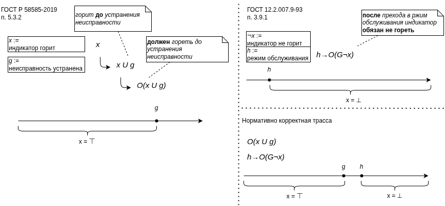
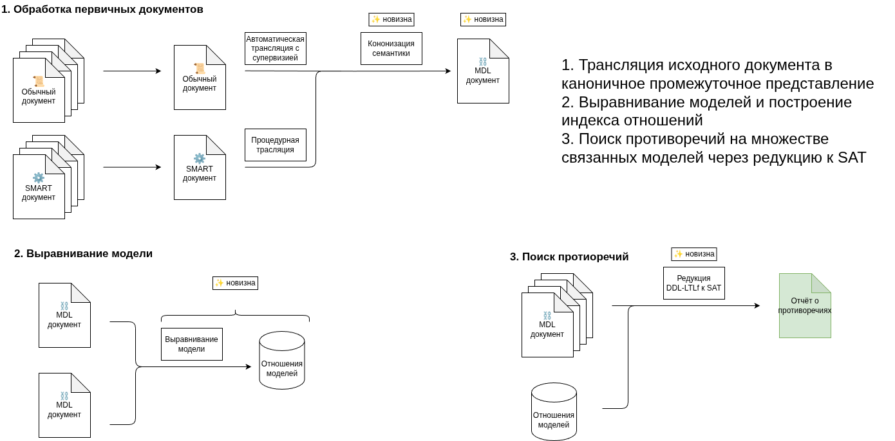
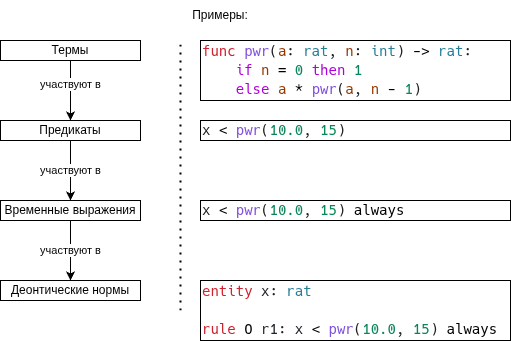
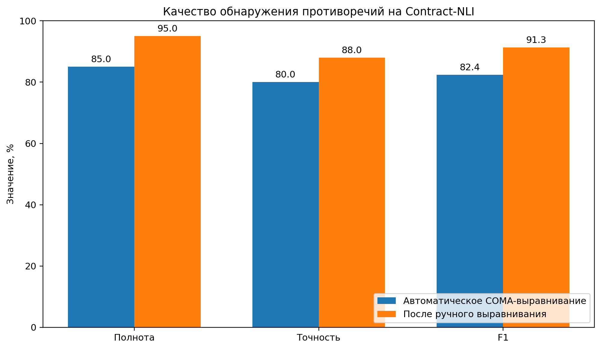
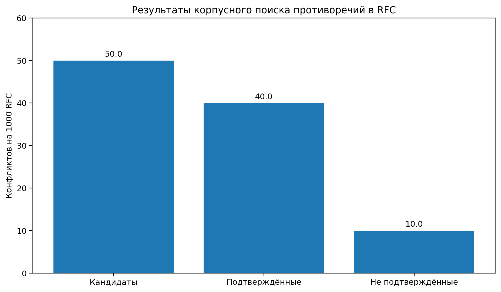
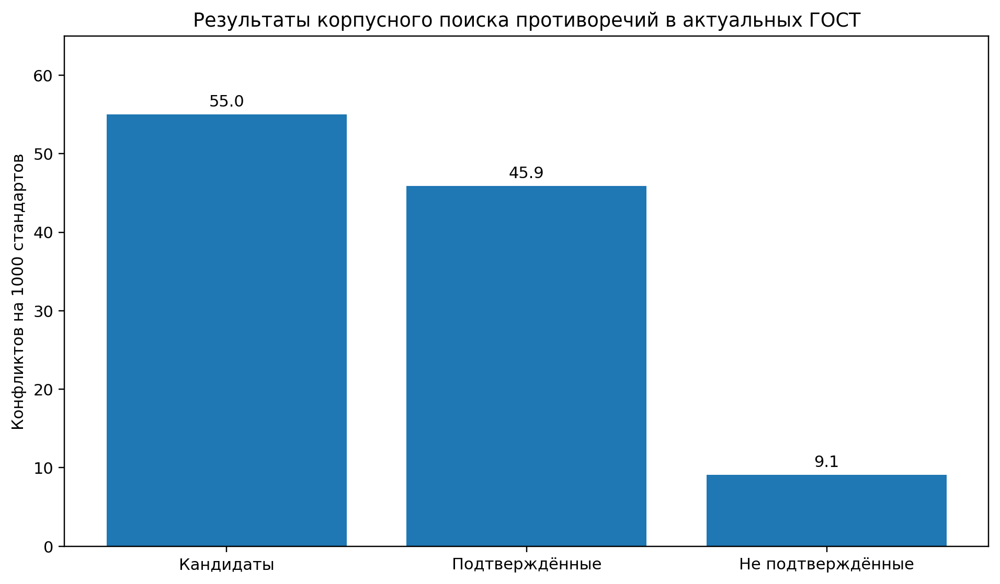

# Общая характеристика работы

**Актуальность.** Управление требованиями является сложным процессом, включающим
ряд взаимосвязанных подпроцессов, требующих высокой квалификации и временных
затрат для людей-исполнителей. С ростом объёма нормативной документации,
особенно в области информационных технологий, процесс управления требованиями,
как и его подпроцессы, становится более трудоёмким.

Одним из подпроцессов управления требованиями является сопоставление нормативных
документов на предмет наличия в них противоречивых требований. Наличие таких
противоречий обусловлено тем, нормативные документы создаются различными
ведомствами и не всегда согласовываются между собой. Применение информационных
технологий для выявления таких противоречий сдерживается тем, что в подавляющем
своем количестве они представлены в обычном текстовом режиме. Основным режимом
анализа таких документов является ручная обработка, что приводит к низкой
производительности труда в этой области и наличию ошибок, связанных с
человеческим фактором.

Таким образом разработка и практическая реализация технологий выявления
противоречивых требований в нормативных документах является актуальной задачей и
ее решение приведет к существенному повышению производительности и качества
труда в области управления требованиями.

**Состояние проблемы**. Автоматизация анализа нормативных документов развивается
на пересечении формальных методов, инженерии требований, логики норм, обработки
естественного языка и цифровой стандартизации. Формальные методы представления и
проверки требований исследовались А. К. Петренко, В. В. Куляминым, А. В.
Хорошиловым, В. А. Семеновым, С. В. Морозовым и другими учёными; в зарубежных
исследованиях значительный вклад внесли Г. Говернатори, А. Ротоло, Дж. Сартор,
М. Пальмирани, Дж. Де Джакомо и М. Варди. Работы Тихомирова С.Г., Головина С.А.,
… в основном направлены на применение для рассматриваемой задачи умных
документов. Есть практические результаты, но они требуют предварительных работ
по переводу нормативных документов в машинопонимаемый формат, на что
потребуется, для практического применения этой технологии, несколько лет. А
конкретные решения нужны уже сейчас.

Логико-ориентированные подходы к данной проблеме представлены деонтическими,
немонотонными и временными логиками, а также средствами проверки соответствия
процессов нормативным требованиям. Дефизибельная деонтическая логика позволяет
выражать обязанности, запреты и разрешения, учитывать исключения, приоритеты
норм и обязанности, возникающие при нарушении исходных предписаний; на её основе
созданы, в частности, средства проверки нормативного соответствия семейства
Regorous. Временные логики LTL, LTLf и LDLf применяются для описания
последовательностей действий, сроков и ограничений на конечных трассах
исполнения. Вместе с тем эти направления преимущественно развиваются раздельно:
деонтические формализмы обычно не охватывают временную структуру конечных
нормативных сценариев, а временные логики непосредственно не участвуют в выводе
нормативной семантики.

Другую группу образуют методы NLP, машинного обучения и большие языковые модели,
используемые для выделения требований, установления связей между ними и
обнаружения семантически противопоставленных фрагментов. Исследования Л. Чжао,
А. Феррари, Ш. Колахдуз-Рахими, К. Лано и других авторов показывают, что
автоматическая формализация требований остаётся преимущественно
экспериментальным направлением, для которого характерны зависимость от
предметной области, недостаток общепринятых наборов данных и трудность
сопоставления результатов различных методов. Современные LLM уже применяются для
преобразования нормативного текста в наборы формальных деонтических правила,
однако вероятностное выявление потенциально конфликтующих положений не
гарантирует их логического противоречия.

Таким образом, не получило завершённого решения совместное применение методов
извлечения требований из естественного языка, междокументного выравнивания
понятий и формальной верификации нормативного окружения. Требуется подход,
который одновременно учитывает деонтическую модальность, исключения и
приоритеты, временную структуру требований и обеспечивает вычислимую проверку их
совместной выполнимости.

**Цель исследования**:

Целью диссертационного исследования является разработка системы
автоматизированного обнаружения противоречивых положений в нормативном окружении
в процессе управления требованиями, применимого в ближайшей перспективе.

**Задачи исследования**:

1. Анализ существующих методов формального представления нормативных требований.
2. Определение и обоснование необходимых свойств формального представления
   нормативных требований для обеспечения автоматизированного обнаружения
   противоречий.
3. Разработка математической модели для формального представления требований с
   учётом выявленных необходимых свойств.
4. Разработка алгоритмического и программного обеспечение системы поиска
   противоречий, включая подсистемы _выявления_ формализованных требований из
   текстов стандартов на естественном языке, хранения и представления
   формализованных требований, автоматизированного поиска и представления
   противоречий.
5. Оценить качество выявления противоречий такой системой на множестве
   нормативных документов.

**Объект исследования:** процессы управления требованиями.

**Предмет исследования:** методы и алгоритмы обнаружения противоречий между
требованиями нормативных документов.

**Методология и методы исследования:** в работе используются методы
математического моделирования, нормативной и временной логики, доказательства
теорем, анализа и машинного обучения, технологии формирования умных документов.

**Научная новизна** работы состоит в разработке технологии автоматизированного
поиска противоречий в нормативных документах разных видов (законы, стандарты,
технические условия, и другие).

<!-- Промежуточные научные результаты включают:

Уточнение понятийного аппарата задачи обнаружения противоречий в нормативных
документах и формулировке требований к формальной модели требований и
противоречий: строгая формальная семантика, выразимость исключений и
приоритетов, выразимость временной структуры и вычислимая процедура проверки.

Предложение нового формализма представления требований, объединяющего
дефизибельную деонтическую логику с временной логикой на конечных трассах.
Непротиворечивость в этом формализме определяется как существование нормативно
корректной трассы, удовлетворяющей требованиям всех победивших норм; для
фиксированного горизонта задача сводится к проверке разрешимости булевой
формулы.

Предложение методов реализации системы обнаружения противоречий: язык MDL как
промежуточное представление требований, методика синтеза формального
представления из исходного документа, межмодельное выравнивание, индексация
отношений моделей и алгоритм поиска противоречий. -->

**Теоретическая и практическая значимость.** Теоретическая значимость работы
состоит в формальном описании нормативных требований с учётом деонтической,
дефизибельной и временной семантики, а также в сведении задачи проверки наличия
противоречий к задаче разрешимости булевых формул (SAT-задаче).

Практическая значимость состоит в автоматическом выявлении противоречий
предъявляемыми к объекту требованиями, содержащимися в различных нормативных
документах.

**Положения, выносимые на защиту.**

Результаты анализа, понятийный аппарат и требования к формальной модели
представления требований, пригодной для обнаружения противоречий в нормативных
документах.

Формализм DDL-LTLf для представления нормативных требований, их ограничений и
условий применимости, а также теорема о сводимости задачи обнаружения
противоречий в формулах DDL-LTLf к задаче SAT.

`[Из текста следует, что все перечисленное представляется к защите как своя разработка]{.cs a=sg}`
Методы реализации системы обнаружения противоречий`[]{.ce}`: язык промежуточного
представления MDL, методика синтеза формального представления из исходных
документов,
`[Исправил формулировки, теперь тут только свои разработки]{.cs a=me}`применение
канонизации имён для повышения качества межмодельного выравнивая, применение
межмодельного выравнивания для сопоставления требований из разных нормативных
документов, оптимизация количества вычислений за счёт индексации отношений
моделей`[]{.ce}`.

`[В принципе достоверность в данном случае должна подтверждаться совпадением ручного и автоматизированного анализа]{.cs a=sg}`**Достоверность
и обоснованность**`[]{.ce}` научных результатов диссертации подтверждена
теоретическими и
`[Эксперименты в том числе сравнивают результаты автоматического поиска противоречий с ручной разметкой]{.cs a=me}`экспериментальными`[]{.ce}`
исследованиями моделирования и мониторинга в форме моделей и методов
информационного моделирования, использованием теории моделирования, корректным
применением теоретических положений, согласованностью полученных результатов с
результатами других исследователей, а также апробацией и обсуждением результатов
на научных конференциях, рецензированием и экспертизой научных статей,
опубликованных в ведущих научных изданиях.

**Соответствие паспорту специальности.** Основные результаты соответствуют
следующим пунктам паспорта специальности 2.3.5: №1 "модели, методы и алгоритмы
проектирования, анализа, трансформации верификации и тестирования программ и
программных систем"; №4 "интеллектуальные системы машинного обучения, управления
базами данных и знаний, инструментальные средства разработки цифровых
продуктов"; №7 "модели, методы, архитектуры, алгоритмы, форматы, протоколы и
программные средства человеко-машинных интерфейсов, визуализации и
многомодального взаимодействия"; №10 "оценка качества, стандартизация и
сопровождение программных систем".

**Аппробация.** Результаты работы докладывались и обсуждались на научных
конференциях:

- 13-й Международной научной конференции "ИТ-Стандарт 2024" (23 мая 2024 г.,
  Москва)
- 9-й Международной научно-практической конференции "Мехатроника, автоматика и
  робототехника" (12 марта 2025г., Санкт-Петербург)
- 14-й Международной научной конференции "ИТ-Стандарт 2025" (11 декабря 2025 г.,
  Москва)
- 14-й Международной научно-практической конференции "Инновации в науке и
  технологиях: глобальные перспективы и локальные решения" (30 апреля 2026 г.,
  Саратов)
- 10-й Международной научно-практической конференции "Конвергенция наук:
  исследование междисциплинарных границ" (30 мая 2026 г., Саратов)

**Публикации по теме.** По материалам диссертации опубликовано 12 научных работ,
в том числе 5 статей в изданиях, рекомендованных ВАК РФ по специальности 2.3.5.

**Личный вклад автора.** Основные результаты, выносимые на защиту, получены
автором лично. Из 12 публикации: 5 - без соавторов, 1 - в соавторстве с научным
руководителем, в 6 работах соавторство связано с выполнением исследований в
рамках общей научной проблематики.

**Структура и объём диссертации.** Диссертационное исследование состоит из
введения, 3 глав, заключения, списка использованной литературы и \_\_-х
приложений. Общий объём работы составляет \_ с., включает рисунков, \_\_ таблиц,
библиографический список из 92 наименования.

```{=openxml}
<w:p>
  <w:r>
    <w:br w:type="page"/>
  </w:r>
</w:p>
```

# Основное содержание

[1. То есть получается введение дублирует всю общую характеристику работы из
автореферата? 2. Получается я всё же не могу представь во введении теоретическую
основу моей работы]{.cs a=me}Во **введении**[]{.ce} обоснована актуальность темы
диссертационной работы, сформулирована цель и основные задачи в общей проблеме
автоматизации управления требованиями, перечислены методы исследования, раскрыта
новизна и практическая значимость полученных результатов работы.  
формализации нормативных требований и автоматизированного выявления
противоречий, рассмотрены теоретические основы деонтической и темпоральной
логик, подходы к формализации стандартов и методы формальной верификации,
показана их взаимосвязь применительно к решаемой задаче.

В **первой главе** «Анализ формализмов представления нормативных требований»
исследованы существующие подходы к формализации требований с позиции их
применимости к автоматизированному поиску противоречий в нормативных документах
и цифровых моделях объектов стандартизации. Показано, что цели формализации
различаются: одни средства ориентированы на машиночитаемое представление и обмен
требованиями, другие — на верификацию поведения систем, анализ норм и
исключений, структурирование целей либо каталогизацию нормативных актов. В связи
с этим наличие машиночитаемой формы само по себе не обеспечивает возможность
автоматического выявления конфликтов: необходим формализм, который одновременно
сохраняет нормативный смысл требований, отражает условия их действия и допускает
алгоритмическую проверку.

Сформулированы основные свойства такого формализма, который можно будет
использовать для автоматизированного выявления противоречий. В работе показано
что первым, и обязательным свойством является строго определённая формальная
семантика, исключающая зависимость результата анализа от внешней интерпретации
естественно-языкового текста. Второе свойство состоит в выразимости норм с
исключениями и приоритетами. Нормативные документы содержат общие и специальные
положения, альтернативные требования, оговорки и правила, действие которых
зависит от контекста. Типовыми являются ситуации, когда требование применяется
только в определённом режиме работы, когда нормативные источники образуют
иерархию юридической или технической силы либо когда норма вступает в действие
при наступлении заданного условия. Показано, что в следствие этого, формализм
должен поддерживать дефизибельные, то есть допускающие отмену или
переопределение, правила и явное отношение приоритета между ними. При отсутствии
этих механизмов вторичные и компенсирующие обязанности могут ошибочно
интерпретироваться как логические противоречия, а результаты проверки становятся
систематически неточными.

Третьим свойством является явное представление временной структуры требований.
Норма действует в определённом интервале актуальности, может быть связана с
началом или завершением процедуры, задавать порядок событий и устанавливать
сроки исполнения. Показано, что игнорирование временной семантики приводит к
ложноположительным конфликтам между требованиями разных редакций или режимов
действия и к ложноотрицательным результатам, когда противоречие возникает только
на отдельном участке процесса. Четвёртым свойством является практическая
вычислимость задачи поиска противоречий. Выразительность формализма должна
сочетаться с возможностью свести проверку выполнимости и совместимости
требований к алгоритмически решаемым задачам, поддерживаемым существующими SAT-,
SMT- и ASP-решателями либо средствами проверки моделей. Тем самым в главе
выделены четыре взаимосвязанных критерия: строгая семантика, дефизибельность,
темпоральность и инструментальная проверяемость.

В работе рассмотрен ряд средств формального представления требований.

| Класс                                | Строгая семантика | Деонтическая структура | Временная структура | Вычислимость |
| ------------------------------------ | :---------------: | :--------------------: | :-----------------: | :----------: |
| Деонтические логики                  |         +         |           ±            |          −          |      ±       |
| Временные логики                     |         +         |           −            |          +          |      +       |
| Модели целей и бизнес-правил         |         ±         |           ±            |          ±          |      ±       |
| Специализированные нормативные языки |         +         |           +            |          ±          |      ±       |

Первый класс средств — нормативные, или деонтические, логики. Стандартная
деонтическая логика вводит модальные операторы обязательства и разрешения:
формула $O \  p$ означает обязательность положения $p$, а $P \ p$ — его
разрешённость. Такое представление создаёт строгое семантическое ядро для
описания предписаний, запретов и разрешений и позволяет фиксировать
непосредственные конфликты, например одновременное требование выполнить и не
выполнить одно действие. Вместе с тем классическая деонтическая логика является
монотонной и сталкивается с парадоксами при описании условных, вторичных и
компенсирующих обязанностей. Существуют расширения деонтической логики,
устраняющие часть этих ограничений: в дефизибельной деонтической логике нормы
задаются как правила, для которых допускаются исключения, блокирующие правила и
приоритеты. Более специальная или более сильная норма при конфликте может
отменять действие общей. Это строить более близкую к оригиналу модель
нормативного документа, однако большинство деонтических логик не содержит
развитых средств описания сроков, последовательности событий и динамики
исполнения обязанностей.

Второй класс образуют временные логики. Линейная временная логика LTL описывает
поведение системы как последовательность состояний и использует операторы $G$
(«всегда»), $F$ («когда-либо в будущем»), $X$ («на следующем шаге») и $U$ («до
тех пор пока»). Требование о том, что каждый запрос в дальнейшем должен быть
обработан, может быть представлено формулой
$G(\text{Запрос}) \rightarrow F(\text{Обработан})$. Для конечных процессов
рассмотрена LTLf — временная логика на конечных трассах, семантика которой
задаётся на конечных последовательностях состояний. Она соответствует
бизнес-процессам, транзакциям и протоколам с фиксированными началом и
окончанием, связана по выразительной мощности с регулярными свойствами и
конечными автоматами. Преимуществом LTL и LTLf является развитая
инструментальная база, представленная системами верификации и визуализации. Тем
самым временные логики наиболее полно удовлетворяют критериям темпоральности и
автоматизируемой проверки. Однако нормативный смысл в них выражается лишь
косвенно: формула задаёт жёсткое ограничение на допустимое поведение, а её
нарушение трактуется как несоответствие модели. Само нарушение не становится
самостоятельным состоянием, для которого можно задать определённые последствия,
как это позволяет сделать дефизибельная деонтическая логика. Временные логики
также не различают норму и факт и не содержат встроенных понятий обязанности,
разрешения и запрета. Поэтому для представления нормативных документов их
необходимо сочетать с деонтическими и дефизибельными механизмами.

Третий класс включает структурные методологии инженерии требований и языки
бизнес-правил. В методологии KAOS требования организуются в иерархию целей,
декомпозируются на подцели и связываются с ответственными агентами и операциями
системы. Интеграция KAOS с временной логикой позволяет проверять реализуемость
целей и обнаруживать случаи, когда несколько целей не могут быть достигнуты
одновременно. Приоритеты целей могут использоваться для выбора компромиссного
решения. Вместе с тем KAOS не вводит явного различия между обязанностью,
разрешением и запретом, а исключительные ситуации обычно описываются отдельными
ветвями модели. Модель i\* дополняет этот подход представлением акторов и
зависимостей между ними, благодаря чему удобна для фиксации обязательств,
представляющих отношения между исполнителями. Её ограничением является
отсутствие единой строгой семантики, сопоставимой с логическими формализмами;
автоматическая проверка требует предварительной трансляции модели в систему
формальных ограничений.
`[Тут была не очень корректная формулировка]{.cs a=me}`Стандарт SBVR`[]{.ce}`
является средством представления терминологии и бизнес-правил в контролируемой
естественно-языковой форме со строгой интерпретацией. Он позволяет описывать
предписания и разрешения, связывать их с понятиями предметной области и
сохранять трассируемость между нормативным текстом и его структурированным
представлением. Правило «каждый заказ должен быть подтверждён в течение 24
часов» одновременно фиксирует деонтическую модальность и временное ограничение в
форме, понятной эксперту. SBVR удобен для извлечения, согласования и хранения
требований, однако сам по себе не содержит механизма вывода и алгоритма проверки
противоречий. Для автоматизированного анализа правила должны быть преобразованы
в деонтическую логику, продукционные правила, ограничения первого порядка или
другую исполнимую нотацию. Следовательно, средства моделирования целей и
бизнес-правил обеспечивают высокую понятность и структурную выразительность, но
лишь частично удовлетворяют требованиям строгой семантики, темпоральности и
непосредственной вычислимости.

Четвёртый класс составляют специализированные юридические нормативные языки и
средства нормативных многоагентных систем. LegalRuleML предназначен для
машиночитаемого представления правовых правил вместе с их атрибутами и
поддерживает деонтические модальности, исключения и приоритеты, строгие и слабые
отрицания, область действия и временные характеристики норм. Он позволяет
связать фрагмент нормативного документа с формальным правилом, указать носителя
обязанности и условия применимости. При высокой выразительности LegalRuleML
остаётся прежде всего форматом представления и обмена: для проверки выполнимости
и вывода последствий ему необходим внешний логический механизм. Язык InstAL
ориентирован на моделирование норм, полномочий и санкций в многоагентных
системах. Спецификация транслируется в форму программирования набора ответов,
после чего решатель строит допустимые состояния и траектории системы. За счёт
немонотонной семантики InstAL поддерживает исключения, а введение дискретного
времени позволяет анализировать развитие нормативной ситуации и выявлять
нарушения. В направлении нормативных многоагентных систем аналогичные задачи
решают MOISE+ с языком NPL и исполнимый язык eFLINT, в котором нормы и факты
задаются через состояния и правила переходов. Эти средства сочетают
представление норм с мониторингом исполнения и моделями санкций, но
ориентированы преимущественно на управление поведением конкретной системы, а не
моделирование требований. Их применение в системах управления нормативными
требованиями требует адаптации предметной модели и специальных знаний в области
логического программирования и юридической информатики.

Показано, что рассмотренные классы формализмов взаимно дополняют друг друга, но
ни один из них не удовлетворяет всем сформулированным критериям одновременно.
[Это надо сформулировать как первый вывод]{.cs a=sg}Таким образом, в первой
главе обоснована необходимость комбинированного формализма представления
нормативных требований. Такой формализм должен объединять деонтическую семантику
обязанностей, разрешений и запретов;[]{.ce}[А как именно его оформить?]{.cs
a=me}[]{.ce} дефизибельные правила для задания исключений и приоритетов;
временные конструкции для описания сроков, интервалов действия и порядка
событий; а также формальное представление, допускающее сведение поиска
противоречий к существующим решателям.

**Во второй главе**, "Математическая модель DDL-LTLf и сведение поиска
противоречий к SAT", представлен формализм, предназначенный для представления и
автоматизированной проверки нормативных требований, содержащих временные
условия, исключения и приоритеты. Предложенная логика DDL-LTLf объединяет
дефизибельную деонтическую логику DDL с временной логикой конечных трасс LTLf.
Такое объединение позволяет описывать не только обязанности, разрешения и
запреты, но и порядок событий, сроки и условия действия норм, сохраняя
возможность алгоритмической проверки их совместимости.

{width=72%}

Исходя из этого, в работе показано, что поиск противоречия сводится к проверке
выполнимости булевой формулы $F_N^K$, построенной по определённому закону.
Найденное решение показывает нормативно корректную трассу и множество победивших
норм, а невозможность решения булевой формулы свидетельствует об отсутствии
нормативно корректной трассы на выбранном горизонте.

Сформулирована и доказана теорема об эквивалентности DDL-LTLf противоречия и
неразрешимости булевой формулы $F_N^K$. Корректность сведения показана
построением из любой модели $F_N^K$ конечной трассы $\pi$ и множества норм $W$,
совпадающего с $\mathrm{Win}\_N(\pi)$; из истинности $B^K$ и $C^K$ следуют
применимость этих норм и выполнение всех порождённых ими требований. Полнота
доказывается обратным построением: любой нормативно корректной трассе ставится в
соответствие булева оценка переменных $p_t$ и меток $\lambda_i$, удовлетворяющая
$\Delta^K$, $B^K$ и $C^K$. Следовательно, $F_N^K$ выполнима тогда и только
тогда, когда $N$ непротиворечив на горизонте $K$, и невыполнима тогда и только
тогда, когда $N$ противоречив.

Таким образом, формализм DDL-LTLf может быть использован как математическая
модель для представления требований и автоматизированного обнаружения
противоречий.

**Третья глава**, "Методы реализации системы", посвящена разработке методов и
программных средств, обеспечивающих практическое применение математической
модели DDL-LTLf, предложенной во второй главе, для обнаружения противоречий в
нормативных документах. Представлен язык промежуточного представления MDL,
алгоритм проверки MDL-моделей, инструменты построения и анализа MDL-модулей,
подход к автоматическому выводу моделей из естественного языка, алгоритм выборки
междокументного контекста. Представлены результаты оценки качества поиска
противоречий. Представлена архитектура подсистемы вывода нормативных требований
из документов на естественном тексте: "нормативный текст — формальная модель MDL
— статически проверенное абстрактное синтаксическое дерево — задача ограниченной
выполнимости — объяснимый результат". Принципиальной особенностью является
локализация эвристических этапов: генерация модели, нормализация имён,
установление связей между модулями и подключение внешних данных могут
выполняться вероятностными методами, однако заключение о наличии или отсутствии
противоречия формируется только решателем в явно заданном строго формальном
контексте. Представлена архитектура системы поиска противоречий: "вывод
требований — межмодельное выравнивание — индексация отношений — поиск
противоречий над всеми связанными моделями". Общая схема работы системы поиска
противоречий представлена на рисунке:



[Тут речь именно пр язык сначала]{.cs a=me}Язык MDL[]{.ce} представляет собой
специализированный предметно-ориентированный язык описания нормативных моделей.
MDL модуль позволяет представить предметные сущности (модели объектов к которым
представляются требования), их свойства, факты, нормативных правила, условий
применимости правил, исключения и приоритеты правил, и ссылки на первоисточники
элементов модели. Модульность и статические типы позволяют использовать словари
предметной области, общие определения между моделями, независимо построенных по
разным документам. Устойчивое имя и тип объекта становятся опорными точками для
последующего межмодульного выравнивания.

Семантика [тут речь скорее про семантику языка]{.cs a=me}MDL модуля[]{.ce} имеет
три основных уровня. Первый уровень образуют термовые выражения: литералы,
арифметические и булевы операции, записи, кортежи, функции, условные выражения и
сопоставление с образцом. [Здесь ы функциональные схемы, которые будут в работе
и на слайдах]{.cs a=sg}Эти конструкции вычислимы, но сами по себе не имеют
нормативного смысла. Второй уровень образуют конечные темпоральные формулы LTLf
с операторами always, eventually, next, now и until. На третьем уровне задаются
деонтические правила с деонтическими модальностями обязанности, разрешению и
запрету. Условные нормы имеют границы применимости. Для представления
дефизибельных норм используются дефизибельные[]{.ce} (могут быть побеждены и
участвовать в отношениях приоритета), строгие (безусловны, не могут быть
исключены из $Win_N$) и defeater правила (может блокировать другое правило, не
создавая самостоятельного обязательства). Реализована семантика `override`,
задающая отношение приоритета между нормами. Благодаря этому в одной модели
представляются общее требование, специальное исключение и порядок разрешения
возникающего между ними конфликта.



Для обеспечения трассируемости в MDL введены аннотации источника. Они
связываются с модулем, типом, сущностью, фактом, правилом или приоритетом и
сохраняются в структурном представлении модели. Аннотации не изменяют логическую
семантику, но позволяют при обнаружении противоречия перейти от внутренних
переменных решателя к конкретным положениям исходных документов. В результате ,
при наличии конфликта, помимо самой неразрешимой формулы $F_K^N$, представляются
ссылки на конкретные разделы, пункты, и строки документов-источников, между
которыми возник нормативный конфликт.

Наряду с каноническим синтаксисом `.mdl`, оптимизированным для чтения и
понимания модели человеком, реализованы инструменты интеграции машинной
интеграции. Специальный вариант синтаксиса `.mdl.py`, являющийся строгим
подмножеством языка Python, оптимизирован для автоматического вывода модели
требований из документов на естественном языке с помощью больших языковых
моделей. Библиотека `mdl.ModelBuilder` оптимизирована для выполнения
эквивалентного преобразования из других машинопонимаемых форматов требований.
Менее строгое подмножество канонического MDL в рамках ключевого слова `fact`
оптимизировано для интеграций внешних систем таких как CAD и PLM. В
разработанной системе все сценарии интеграции, наряду с основным представлением
нормативных требований извлечённых из нормативных документов, позволяет
интегрировано верифицировать согласованность всех данных, связанных единым
нормативным контекстом.

Для автоматического преобразования нормативных документов в MDL разработан
компонент mdl-gen. Его входом являются текст и структура документа, метаданные
источника и предметные словари, а выходом — MDL-модуль. Процедура включает
сегментацию текста на требования, определения, исключения, условия, таблицы и
ссылки; выделение сущностей, свойств, ролей и единиц измерения; построение
деонтических и темпоральных правил; распознавание исключений и приоритетов;
форматирование, статическую проверку и пробный запуск на малом горизонте. В
MCP-контуре генератор получает сведения о языке, строит AST, запускает
форматирование, анализирует диагностику lint и использует результаты solve для
исправления модели. Тем самым языковая модель выступает не источником
окончательного решения, а управляемым компонентом синтеза, ограниченным
грамматикой, системой типов и формальным решателем. Поддерживаются канонический
текстовый синтаксис `.mdl` и структурный синтаксис `.mdl.py`, преобразуемый
библиотекой ModelBuilder в то же абстрактное синтаксическое дерево.

Межмодельное выравнивание сопоставляет элементы независимо построенных моделей,
которые обозначают один объект различными именами, и формирует явные связи между
типами, свойствами и отношениями перед запуском решателя. Оно не устанавливает
наличие противоречия, а обеспечивает общий формальный контекст для solve. В
проведённом вспомогательном эксперименте на 32 RFC, шести генеративных моделях,
трёх сценариях и пяти запусках было получено 2880 артефактов. Единая инструкция
по именованию и структуре увеличила pair_alignment_f1 относительно контроля на
46,2 %, тогда как добавление семантической обратной связи дало прирост 40,3 % и
уступило guided-сценарию на 4,0 %. Следовательно, основным средством повышения
межмодельной сопоставимости является предварительная канонизация, а обратную
связь целесообразно применять прежде всего для исправления диагностируемых
ошибок.

Для поиска
`[В начале главы должна быть полная схема, а далее ее рассказ.]{.cs a=sg}`междокументных`[]{.ce}`
конфликтов разработан индекс отношений. Он хранит связи между модулями,
сущностями, типами, полями и правилами, включая эквивалентность, уточнение,
преобразование единиц, зависимость и потенциальный конфликт. Индекс отбирает
релевантные модули и правила выравнивания, после чего проверка выполняется
решателем Z3. Тем самым вероятностные процедуры отвечают за построение и
связывание моделей, а заключение о противоречии остаётся воспроизводимым
свойством явно сформированного формального контекста.

В экспериментах положительным считался экспертно подтверждённый нормативный
конфликт. Оценивались полнота `recall`, точность `precision` и их гармоническое
среднее `F1`; для экспериментов дополнительно использовалось число кандидатов и
подтверждённых конфликтов на 1000 документов. Ошибки разделялись на ошибки
преобразования текста в MDL, ошибки выравнивания, ошибки выбора контекста и
различия области применимости документов.

<!-- Численные результаты трёх следующих экспериментов являются проектными
значениями и должны быть заменены фактическими результатами после запуска. -->

**Эксперимент на Contract-NLI.** Набор данных включал 607 соглашений о
неразглашении и 17 фиксированных гипотез, то есть 10 319 пар «документ —
гипотеза». По каждому договору одной и той же LLM генерировались эквивалентные
представления `.mdl` и `.mdl.py`; гипотеза независимо преобразовывалась в
отдельный `.mdl`-модуль. После автоматического COMA-выравнивания модулей
выполнялся solve. Для примеров с меткой contradiction ожидался результат `unsat`
либо объяснимый конфликт правил, тогда как entailment и not mentioned не должны
были интерпретироваться как противоречие.

Table: Результаты обнаружения противоречий на Contract-NLI

| Представление договора | Выравнивание        | Полнота, % | Доля неподтверждённых результатов, % | Точность, % | F1, % |
| ---------------------- | ------------------- | ---------: | -----------------------------------: | ----------: | ----: |
| `.mdl`                 | автоматическое      |         84 |                                   21 |          79 |  81,4 |
| `.mdl.py`              | автоматическое      |         86 |                                   19 |          81 |  83,4 |
| среднее                | автоматическое      |         85 |                                   20 |          80 |  82,4 |
| `.mdl`                 | с ручной коррекцией |         94 |                                   13 |          87 |  90,4 |
| `.mdl.py`              | с ручной коррекцией |         96 |                                   11 |          89 |  92,4 |
| среднее                | с ручной коррекцией |         95 |                                   12 |          88 |  91,3 |

{width=78%}

Структурный синтаксис `.mdl.py` дал преимущество около 2 процентных пунктов F1
относительно прямой генерации `.mdl`; при попарной проверке по документам эффект
находился на границе статистической значимости (`p = 0,058`). Ручная коррекция
выравнивания во всех ошибочных сценариях повысила среднюю полноту с 85 до 95 %,
снизила долю неподтверждённых конфликтов с 20 до 12 % и увеличила F1 с 82,4 до
91,3 %. Оставшиеся ошибки были связаны преимущественно с неверно восстановленной
структурой объекта договора: отсутствующими ролями сторон, областью действия
оговорок и условиями прекращения обязательств. В этих случаях даже корректное
сопоставление имён не изменяло ошибочную формальную модель. Результат
показывает, что COMA-выравнивание обеспечивает приемлемое исходное качество,
ручное выравнивание заметно улучшает его, а перспективным направлением является
LLM-выравнивание, формирующее явные и проверяемые правила соответствия.

**Эксперимент на множестве RFC.** В набор данных вошли 4000 нормативно связанных
RFC, включая документы Standards Track, Internet Standard и BCP, а также RFC, на
которые они ссылаются нормативно. Документы были преобразованы в MDL,
проиндексированы по терминам, типам, правилам и объединены в связные нормативные
контексты. Решатель запускался не для всех пар документов, а только для пар и
малых групп _(ссылка на работу Теремова)_, отобранных индексом по общим объектам
и несовместимым ограничениям. Для экспертной проверки использовалась
стратифицированная случайная выборка 10 % кандидатов с учётом типа конфликта и
оценки уверенности.

Table: Метрики эксперимента с поиском противоречий в RFC

| Показатель                             |  Значение |
| -------------------------------------- | --------: |
| Документов в наборе денных             |      4000 |
| Найдено кандидатов в конфликты         |       200 |
| Кандидатов на 1000 RFC                 |      50,0 |
| Проверено вручную                      | 20 (10 %) |
| Подтверждено в выборке                 | 16 (80 %) |
| Оценка числа подтверждённых конфликтов |       160 |
| Подтверждённых конфликтов на 1000 RFC  |      40,0 |

{width=72%}

На 1000 RFC приходилось 50 кандидатов в нормативные конфликты, из которых около
40 подтверждались при ручной проверке. Основную часть истинных конфликтов
составили несовместимые предписания MUST и MUST NOT, различающиеся предельные
значения и временные ограничения, а также требования, сохранённые после
обновления документа. Ложные срабатывания чаще всего объяснялись различиями
области применимости, неучтённым отношением замещения версий и смешением
обязательного требования с рекомендуемым поведением. Полученная точность 80 %
показывает, что индекс отношений существенно сокращает пространство проверки и
сохраняет приемлемую нагрузку на эксперта, однако метаданные версий и областей
применимости должны включаться в модель до запуска solve.

_Эксперимент с актуальными ГОСТ._ Из СПС «Техэксперт» был извлечён набор данных
из
`[Противоречия ищутся по всем эти ГОСТ? Но они ВСЕ не обязательно будут входить в нормативное окружение конкретной сущности!]{.cs a=sg}`3200
действующих ГОСТ и ГОСТ Р`[]{.ce}` в областях информационных технологий,
промышленной автоматизации, качества и безопасности. Для каждого документа
фиксировались редакция, дата введения, статус, классификационные коды и
нормативные ссылки; отменённые и заменённые редакции исключались из основного
контекста. После генерации MDL индекс связывал определения, объекты контроля,
единицы измерения, предельные значения и правила испытаний. Как и в эксперименте
на RFC, вручную проверялась стратифицированная выборка не менее 10 % найденных
кандидатов.

Table: Результаты эксперимента с актуальными ГОСТ

| Показатель                                   |    Значение |
| -------------------------------------------- | ----------: |
| Документов в наборе данных                   |        3200 |
| Найдено кандидатов в конфликты               |         176 |
| Кандидатов на 1000 стандартов                |        55,0 |
| Проверено вручную                            | 18 (10,2 %) |
| Подтверждено в выборке                       | 15 (83,3 %) |
| Оценка числа подтверждённых конфликтов       |         147 |
| Подтверждённых конфликтов на 1000 стандартов |        45,9 |

{width=72%}

_Рисунок \_\_ — Число найденных и подтверждённых конфликтов на 1000 актуальных
ГОСТ_

В наборе данных состоящем из ГОСТ было выявлено 55 кандидатов на 1000
документов; экстраполяция ручной проверки дала 45,9 подтверждённого конфликта на
1000 стандартов. Чаще всего обнаруживались несовместимые диапазоны допустимых
значений, различающиеся требования к одной характеристике изделия и
взаимоисключающие процедуры контроля. Большинство неподтверждённых случаев было
связано не с ошибкой решателя, а с различием назначения продукции, условий
эксплуатации либо статуса положения как обязательного или рекомендуемого.
Показанный результат подтверждает применимость двухконтурной схемы к российской
нормативной базе и показывает, что качество поиска в большой степени зависит от
полноты формализации области применимости и от междокументного
`[Нужно ОБЯЗАТЕЛЬНО показать конкретные выявленные противоречия. И в тексте больше схем.]{.cs a=sg}`выравнивания`[]{.ce}`.

Рассмотрим _Пример выявленного противоречия_ и кодирования требований двух
разных стандартов: "ГОСТ 32125-2013 Консервы мясные. Мясо тушеное. Технические
условия" и аналогичный ДСТУ 4450:2005. Стандарты задают требования в том числе к
содержанию мышечных тканей в сырье для консервированного тушёного мяса. ГОСТ
требует менее 6% содержания жировой и соединительной тканей, а ДСТУ требует от 6
до 14%.

```mdl
# ГОСТ
| (MeatType.Beef(), CannedMeatGrade.First()):
      let non_muscle_tissue =
         (raw_meat_properties.connective_tissue_proportion +
         raw_meat_properties.adipose_tissue_proportion)
      (non_muscle_tissue <= 6/100)
```

(\_)

```mdl
# ДСТУ
| (MeatType.Beef(), CannedMeatGrade.Top()):
      let non_muscle_tissue =
         (raw_meat_properties.connective_tissue_proportion +
         raw_meat_properties.adipose_tissue_proportion)
      (6/100 <= non_muscle_tissue and
      non_muscle_tissue <= 14/100)
```

При проверке такого набора требований, выявляется противоречие

```
{
  "status": "unsat",
  "horizon": null,
  "checked_horizons": [
    1,
    2,
    3
  ],
  "conflicts": [
    {
      "id": "core_001",
      "horizon": 1,
      "rules": [
        "alignment_001",
        "alignment_002",
        "m_alignment_001_meat_type",
        "material_proportions_satisfies_bounds"
      ],
      "facts": [
        "fact_1",
        "fact_2"
      ],
   // ...
```

```{=openxml}
<w:p>
  <w:r>
    <w:br w:type="page"/>
  </w:r>
</w:p>
```

# Основные результаты и выводы

**Основной научный результат исследования состоит в** разработке
математического, алгоритмического и программного обеспечения системы
автоматизированного выявления противоречий в нормативных документах.

1. Рассмотрены и проанализированы существующие методы формального представления
   нормативных требований. Определён и обоснован набор свойств формального
   представления, такой чтобы с его помощью было возможно автоматизированное
   выявление противоречий.
2. Разработана математическая модель требований и противоречий, доказано
   сведение задачи поиска противоречий в такой модели к задаче выполнимости
   булевых формул.
3. Разработано алгоритмическое и программное обеспечение системы
   автоматизированного выявления противоречий.

# Публикации по теме диссертации

**В журналах, включенных в перечень ВАК по специальности 2.3.5**

- Прокази М.Р., Теремов И.А. Предложения к стандарту, описывающему умные
  стандарты // ИТ-Стандарт
- Проказин М.Р. Гибридный формализм описания нормативных требований //
  ИТ-Стандарт
- Проказин М.Р., Теремов И.А. Влияние семантической обратной связи на качество
  выравнивания моделей, сгенерированных LLM: масштабированная оценка на примере
  RFC // ИТ-Стандарт
- Проказин М.Р. Алгоритмическое обеспечение и особенности оптимизации системы
  поиска противоречий // (планируется)
- Проказин М.Р. Поиск противоречий в стандартах - оценка качества алгоритма //
  (планируется)

**В журналах РИНЦ**

- Проказин М.Р., Теремов И.А. Подход к синтезу формальных предикатов из
  естественного языка на основе моделей с архитектурой трансформер

**В сборниках трудов конференций**

- Проказин М.Р. Применение методов ИИ для определения противоречий и ограничений
  в ссылочных стандартах и других законодательных и нормативных документах —
  обзор актуальных задач — материалы конференции "ИТ-Стандарт 2024".
- Проказин М.Р. Алгоритм обнаружения потенциальных противоречий между
  SMART-стандартами на основе кластеризации и оценки EMD — материалы конференции
  "Мехатроника, Автоматика и Робототехника 2025".
- Проказин М.Р. Гибридный формализм описания нормативных требований DDL-LTLf —
  материалы конференции "ИТ-Стандарт 2025".
- Проказин М.Р. Семантическая обратная связь при генерации формальных моделей
  как средство повышения качества межмодельного выравнивания — материалы
  конференции "Инновации в науке и технологиях: глобальные перспективы и
  локальные решения
- Проказин М.Р. Дизайн языка представления норм для поиска противоречий —
  материалы конференции Конвергенция наук: исследование междисциплинарных
  границ"

**Свидетельства о регистрации программ для ЭВМ:**

1. Проказин М.Р. Транслятор и решатель MDL языка MDL // Свидетельство о
   государственной регистрации программы для ЭВМ № 2026664119 - 27.04.2026.
