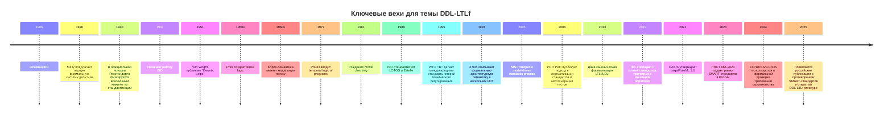
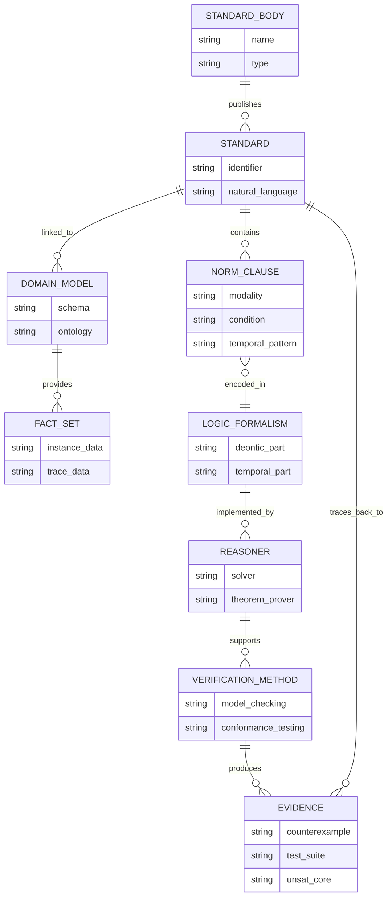
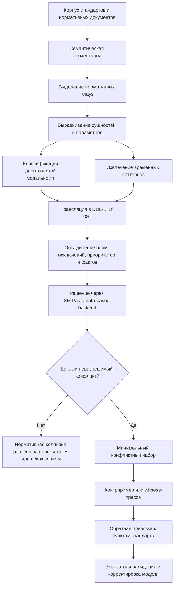

# Контекст и исторический фон систем обнаружения противоречий на основе DDL-LTLf

## Резюме

- Система обнаружения противоречий на основе DDL-LTLf находится на пересечении трех исследовательских линий: деонтической логики как логики норм, временных логик как логик поведения во времени и цифровой стандартизации как перехода от документно-центричных стандартов к машинообрабатываемым и, в пределе, машиноисполняемым нормативным артефактам. В современной литературе эти три линии развиты существенно сильнее по отдельности, чем в едином формализме. citeturn23search2turn21search2turn41search0turn20search0

- Для введения в диссертацию ключевое противоречие состоит не только в расхождении между естественным языком и формальной моделью, но и в более глубокой коллизии между консенсусной, намеренно частично неформальной природой стандартов и требованием к автоматической проверке их непротиворечивости, прослеживаемости и выполнимости. Именно поэтому история формализации стандартов естественным образом ведет к формальной верификации и проверке соответствия. citeturn35view0turn41search0turn5search20

- Выбор LTLf обычно мотивирован тем, что значительная часть нормативных ситуаций в стандартах задает конечные эпизоды — процедуру испытаний, этап жизненного цикла, аудит, обмен сообщением, проверку BIM-модели, выпуск документа. Деонтическая часть нужна для выражения обязанностей, запретов, разрешений, исключений и режимов нарушения; временная — для дедлайнов, последовательностей, продолжительности и конечных трасс. citeturn21search2turn21search7turn24search13turn28search0

- Российская линия исследований здесь особенно заметна в четырех узлах: в логико-философской разработке деонтики и модальности, в математической модальной и временной логике, в прикладных формальных методах для стандартов и проверки соответствия, а также в новой волне работ по SMART-стандартам, синтезу формальных предикатов и обнаружению противоречий в нормативных корпусах. citeturn29search12turn29search13turn38search3turn38search14turn35view0turn11search3turn33view0turn17view0

Отдельно важно зафиксировать терминологическую неопределенность: в международной литературе аббревиатура **DDL** может означать и **Defeasible Deontic Logic**, и **Dyadic Deontic Logic**. В найденном открытом российском прототипе DDL-LTLf DDL явно раскрывается как **Defeasible Deontic Logic**; если в вашей диссертации DDL понимается иначе, это следует специально оговорить уже во введении. В вашем запросе это не уточнено. citeturn17view0turn18search0turn23search4

## Логический фундамент

Логика, на которой может стоять система обнаружения нормативных противоречий, начинается не с деонтики, а с более общего семейства модальных логик. В стандартной крпипковской схеме язык строится из атомов, булевых связок и модального оператора необходимости \( \Box \); модель имеет вид \(M=\langle W,R,V\rangle\), где \(W\) — множество миров, \(R\) — отношение достижимости, \(V\) — оценка атомов, а истинность задается условием \(M,w \models \Box \varphi \iff \forall v\,(wRv \rightarrow M,v \models \varphi)\). Эта общая рамка оказалась необычайно плодотворной: именно она связала философскую модальность, временные операторы, логику программ и позднее — автоматическую верификацию. citeturn22search3turn22search12

Исторически первой формальной системой деонтической логики считается система entity["people","Ernst Mally","austrian logician"] 1926 года. Однако в качестве устойчивой исследовательской области современная деонтическая логика начинается с работы entity["people","G. H. von Wright","finnish philosopher"] 1951 года, после которой появляются стандартная деонтическая логика, парадоксы, дискуссия о conditional obligations и компьютерно-ориентированные версии нормативного рассуждения. При этом важно помнить тонкость, которую чаще всего теряют во вторичных обзорах: у фон Райта в 1951 году деонтические операторы еще относились не к произвольным пропозициям, а к типам действий; нынешняя SDL — это уже ее нормализованный пропозициональный потомок. citeturn40search0turn40search1turn40search8turn23search2

Если зафиксировать минимальный формальный каркас, то **SDL** обычно задают как модальную систему типа KD с оператором обязательности \(O\), производными разрешения \(P\varphi := \neg O\neg \varphi\) и запрета \(F\varphi := O\neg \varphi\). Семантически ей соответствуют серийные крпипковские фреймы: из каждого мира должен быть достижим хотя бы один нормативно приемлемый мир. На уровне введения в диссертацию это определение полезно, потому что оно сразу показывает и силу SDL, и ее слабость: SDL хорошо выражает базовые отношения между обязательным, разрешенным и запрещенным, но плохо справляется с исключениями, приоритетами норм и особенно с парадоксами типа contrary-to-duty. citeturn23search2turn23search6

Именно из-за проблемы contrary-to-duty — когда действует первичная норма и отдельная норма “на случай нарушения” — появляются более богатые формализмы. **Dyadic deontic logics** используют условную форму \(O(\varphi\mid\psi)\), то есть “при условии \(\psi\) обязано быть \(\varphi\)”; это позволяет явно различать идеальный и субидеальный контекст и аккуратнее моделировать нарушение первичной нормы. **Input/output logic** еще радикальнее отказывается рассматривать нормы как обычные истинностные формулы и трактует их как преобразования от фактов ко множеству нормативных выводов. **Defeasible deontic logic** делает следующий шаг: норма становится правилом с возможными исключениями и отношением приоритета между правилами, так что столкновение двух норм еще не означает логического краха — оно может быть снято через superiority relation, explicit exceptions или reparation chains. Для систем обнаружения противоречий это различие принципиально: конфликт правил и неразрешимое противоречие — не одно и то же. citeturn23search4turn23search5turn19search17turn24search13turn26search6

Связь модальной логики с временной проходит через работы entity["people","Arthur Prior","tense logic"], который в 1950-х создал tense logic, и через семантическую революцию entity["people","Saul Kripke","modal logic"] начала 1960-х. Для компьютерных наук решающим моментом стала статья entity["people","Amir Pnueli","temporal logic"] 1977 года “The Temporal Logic of Programs”, где временное рассуждение стало базовым способом задавать свойства программ и параллельных систем. На этой линии затем вырос model checking, а вместе с ним — практическая культура формализации поведения через временные операторы. citeturn22search5turn22search9turn39search2turn39search21

На уровне языка **LTL** вводит операторы \(X\) (“в следующем состоянии”), \(F\) (“когда-нибудь в будущем”), \(G\) (“всегда”), \(U\) (“до тех пор, пока”). Семантика стандартной LTL определяется на бесконечных трассах, что естественно для реактивных систем, сетевых протоколов и операционных систем. **LTLf** сохраняет тот же синтаксис, но интерпретирует формулы на конечных трассах; это не косметическая правка, а смена модели времени. Для конечной трассы \(\pi = s_0 \ldots s_n\) формулы вида \(X\varphi\) и \(U\) должны интерпретироваться уже с учетом возможного конца поведения. Работы по LTLf и LDLf показали, что этот переход тесно связывает логику с конечными автоматами и делает ее особенно удобной для мониторинга, планирования и проверки декларативных процессов. citeturn21search2turn21search6turn21search7

Для задач нормативного рассуждения выбор между LTL, LTLf и ветвящимися логиками обычно определяется не красотой формализма, а устройством самого объекта проверки. Если объектом является проект автомата, протокола или контроллера, то CTL/CTL* и классический арсенал model checking естественны, потому что нужно рассуждать о дереве возможных продолжений. Если же объектом является корпус стандартов, правила испытаний, условия приемки, этапы документооборота, конкретный аудит или BIM-проверка, то более естественным оказывается рассуждение о конечных эпизодах и наблюдаемых конечных трассах; именно поэтому LTLf стал фундаментом языка Declare и многих задач мониторинга бизнес-процессов. Для диссертации о DDL-LTLf это дает сильную методологическую мотивацию: конечная трасса ближе к нормативному “кейсу”, чем бесконечный запуск. citeturn25search0turn25search13turn21search19turn21search21

Отсюда вытекает и естественная логика композиции. Деонтический слой отвечает на вопрос **что должно, может или не должно происходить**; временной слой — **когда, как долго и в какой последовательности это должно происходить**. Гибрид DDL-LTLf тем самым претендует на покрытие четырех типов нормативной структуры сразу: модальность, условность, исключения и конечную временную организацию исполнения. Именно этот четверной узел чаще всего отсутствует в системах, ориентированных только на SDL, только на LTLf или только на NLP-классификацию противоречий. citeturn17view0turn24search13turn21search7turn20search0

## Стандарты как объект формализации

История формализации стандартов начинается задолго до SMART-стандартов. entity["organization","IEC","electrotechnical standards"] был основан в 1906 году; entity["organization","ISO","global standards body"] начал официальную работу в 1947 году. После Второй мировой войны стандартизация стала не только инженерным, но и торгово-правовым механизмом: соглашение entity["organization","WTO","global trade body"] по техническим барьерам в торговле закрепило международные стандарты как опорную среду предсказуемого регулирования. В российском контексте официальная история entity["organization","Росстандарт","russia standards body"] ведет современную систему по крайней мере от всесоюзных институций 1940 года, а нынешняя агентская форма сложилась уже в постсоветский период. citeturn6search1turn6search0turn6search7turn6search10

Но для диссертации о противоречиях важнее не институциональная, а эпистемическая история стандартов. Стандарт исторически создавался как человеческий документ консенсуса. Именно поэтому его текст часто балансирует между однозначностью и политикой согласования интересов, между формальной строгостью и понятностью для отрасли. В результате стандарт оказывается не просто “техническим описанием истины”, а сложным компромиссным нормативным артефактом. Это обстоятельство и делает проблему автоматизированного обнаружения противоречий содержательно трудной: машина должна работать не с математически чистой теорией, а с документом, где неоднозначность часто встроена в процесс выработки самого стандарта. citeturn35view0

Официальная риторика цифровой трансформации стандартов в последние годы формулируется уже иначе. Совместная инициатива IEC/ISO SMART прямо исходит из того, что сегодняшние стандарты прежде всего ориентированы на человека; даже там, где они читаемы компьютером, это еще не означает, что они **интерпретируемы** машиной. Отсюда и переход от document-centric content к данным, пригодным для машинного применения, переноса и включения в программные среды. В российском контексте ПНСТ 864-2023 закрепляет сходную установку: SMART-стандарт — это не просто электронный файл, а совокупность данных, делающая документ машинопонимаемым и пригодным для использования информационными и киберфизическими системами. citeturn41search0turn41search20turn5search20turn34view0

С практической точки зрения цифровая трансформация стандартов проходит несколько стадий. Сначала стандарт просто переводится из бумаги в PDF/HTML. Затем появляется структурированная разметка, метаданные, каталогизация, сервисы навигации, открытые машиночитаемые наборы данных, онлайн-платформы просмотра и обмена. Следующий шаг — моделирование предметной области и ограничений на данные через формальные схемы и онтологии. Еще дальше лежит стадия, на которой требования уже можно автоматически проверять на конкретных моделях, изделиях, документах или трассах исполнения. Наконец, предельная фаза — частично исполнимый или верифицируемый стандарт, способный сам входить в цепочку цифрового проектирования, контроля и сертификации. Эта стадийность не является единой “официальной” международной классификацией; ниже она используется как аналитическая реконструкция на основе официальных документов IEC/ISO, российского ПНСТ и отраслевых примеров. citeturn41search0turn41search3turn41search5turn5search20turn28search2turn28search0

Именно здесь особенно важны репрезентативные примеры. В производственной и инженерной сфере семейство STEP, поддерживаемое через ISO 10303 и язык EXPRESS, уже давно выступает модельно-ориентированным ядром обмена данными. В строительстве IFC и IDS делают информационные требования компьютерно интерпретируемыми и прямо обещают автоматическую compliance checking BIM-моделей. В экосистеме ISO одновременно развиваются открытые данные и онлайн-платформы доступа, а в российской профессиональной среде SMART-стандарты продвигаются через ПТК 711, консорциумные платформы и прикладные отраслевые сценарии. Для диссертации это важно потому, что противоречие постепенно перестает быть только лингвистической проблемой текста: оно становится проблемой совместимости моделей, схем, проверок и цифровых сервисов. citeturn28search2turn28search3turn28search0turn28search1turn41search3turn15search0

## Формальная верификация и выравнивание моделей

Формальная верификация вошла в инженерную культуру через временную логику и model checking. После статьи Пнуэли в 1977 году уже в начале 1980-х entity["people","Edmund M. Clarke","model checking"] и entity["people","E. Allen Emerson","model checking"] в США и entity["people","Joseph Sifakis","model checking"] во Франции независимо создали метод автоматической проверки конечно-состоянийных систем по темпоральным спецификациям. Позднее именно за это направление была присуждена премия Тьюринга 2007 года, а ACM подчеркивал, что оно стало широко используемой индустриальной технологией. citeturn39search2turn39search3turn39search8turn39search18

Для истории стандартов особенно существенно, что формальные методы довольно рано стали не просто “внешним математическим инструментом”, а частью самой стандартизационной практики. В телекоммуникациях и OSI-мире были стандартизованы formal description techniques: LOTOS как ISO 8807, Estelle как ISO 9074, SDL в серии рекомендаций ITU-T. Рекомендация entity["organization","ITU-T","telecom standards sector"] Z.110 специально посвящена критериям применения формальных методов в стандартах. В рекомендации X.904 формальная архитектурная семантика строилась сразу в четырех языках — LOTOS, ESTELLE, SDL и Z — и это, по собственному описанию стандарта, улучшало согласованность архитектурных спецификаций. Здесь виден принцип, который позже станет центральным и для SMART-стандартов: формализация — это не только исполнение, но и инструмент устранения внутренних несогласованностей исходного текста. citeturn27search2turn27search3turn27search7turn7search8

Именно на этом основании логично вводить понятие **выравнивания моделей**. В контексте стандартов оно означает согласование как минимум четырех слоев: исходного текста стандарта, выделенных из него требований, формальной модели этих требований и артефактов проверки — тестов, трасс, сертификатов, counterexample witness. Российская статья 2006 года группы ИСП РАН формулирует эту связку предельно ясно: формализация стандартов нужна потому, что сами попытки сделать требования строгими вскрывают противоречия и двусмысленности; но одной формализации мало, необходимы тесты, прослеживаемость требований, декомпозиция, управление изменениями и конфигурациями. В этой же работе подход иллюстрируется на ядре Linux Standard Base и опирается на методики ISO 9646 и ITU-T Z.500. Это, по сути, ранняя русскоязычная формулировка того, что сегодня было бы названо lifecycle alignment между нормой, моделью и доказательством соответствия. citeturn35view0

В 2000-х эта линия получает еще одну форму — model-driven standards. Доклад entity["organization","NIST","us standards institute"] о model-driven standards process прямо говорит, что UML-модели могут входить в устойчивый формальный процесс стандартизации. На стыке промышленного моделирования и цифровых стандартов STEP/EXPRESS превращает часть стандартного содержания в формальные схемы с ограничениями. В строительстве IDS определяется как компьютерно интерпретируемый документ требований к поставке информации, а IFC уже выступает стандартизированным цифровым описанием объекта строительства; вместе они позволяют автоматическую проверку полноты и корректности BIM-моделей. Российская работа 2024 года В. А. Семенова и соавторов добавляет еще один важный шаг: формальную спецификацию и верификацию требований строительства на основе EXPRESS в связи с IFC и IDS. Тем самым видно, что история формализации стандартов идет от формальных языков описания протоколов к цифровым моделям доменов и, далее, к автоматической проверке регуляторных требований в конкретных предметных областях. citeturn8search2turn28search2turn28search3turn28search0turn28search1turn11search3turn11search7

На этом фоне DDL-LTLf-подход попадает в очень определенную историческую точку. Он уже не является просто еще одним способом формализовать текстовую норму. Скорее, он продолжает линию, в которой стандарт понимается как источник машинно проверяемых нормативных ограничений, а формальная модель должна быть одновременно выразительной, объяснимой, связанной с исходным текстом и пригодной для автоматической диагностики конфликтов. Это и есть практический смысл выравнивания моделей для стандартизации: не потерять связь с документом, но сделать возможной автоматическую проверку. citeturn35view0turn28search0turn41search0

## Российские исследовательские линии

Для русскоязычного введения особенно важно не ограничиваться обзором западного канона. **entity["people","Александр Архипович Ивин","russian logician"]** занимает в российской историографии деонтики одно из центральных мест. Доступные русскоязычные источники связывают с ним раннюю советскую разработку логики оценок и попытку свести логики норм к логике абсолютных оценок; в библиографических сведениях регулярно фигурируют его работы *«Основания логики оценок»* (1970), *«Логика норм»* (1973) и позднейшая *Deontische Logik*. Для диссертационного введения это важно не только как факт истории: линия Ивина показывает, что в российской традиции деонтика нередко понималась не как узкий модальный изоморфизм с алетикой, а как часть более широкой теории оценочных и нормативных высказываний. Поскольку в открытом веб-доступе эти сведения чаще представлены через справочные и историографические источники, при финальной академической доработке лучше дополнительно дать ссылки на оригинальные издания или библиотечные каталоги. citeturn29search0turn12search6turn12search8

**entity["people","Юрий Васильевич Ивлев","russian logician"]** представляет другую значимую российскую линию — квазиматричную и квазифункциональную трактовку модальности и деонтики. Официальный профиль философского факультета МГУ относит к его научным интересам модальную и деонтическую логику, а публикационный профиль фиксирует ранние и поздние работы: от статьи *«Истинность нормы»* (1969) и работ по табличному построению модальной логики до статьи *«Деонтическая квазиматричная логика. Логика норм»* (2018). Для вашего сюжета это особенно ценно: у Ивлева модальность и норма рассматриваются не изолированно, а в системе более общих схем логического моделирования. citeturn29search12turn29search8turn29search1

**entity["people","Елена Николаевна Лисанюк","russian philosopher"]** важна прежде всего как исследовательница истории и методологии деонтики в России. Профиль Санкт-Петербургского государственного университета фиксирует ее работы по деонтической логике, а доступные статьи показывают, что она систематизирует две большие линии в понимании норм — “лейбницевскую” и “бентамовскую”, подчеркивая, что отечественная традиция скорее тяготела ко второй, более прагматической и мультимодальной. Через исследования Лисанюк, а также через работы по истории логических идей **entity["people","Александр Сергеевич Есенин-Вольпин","soviet logician"]** и **entity["people","Александр Александрович Зиновьев","soviet logician"]** становится видна еще одна особенность русской линии: для нее характерен интерес не только к “чистой” аксиоматике, но и к связи логики норм с действием, рациональным поведением и прикладным смыслом нормативности. Здесь, однако, следует быть осторожным: значительная часть этого сюжета в открытом доступе реконструируется по вторичным историко-логическим исследованиям. citeturn29search2turn29search13turn12search6turn12search11turn12search7

На стороне общей модальности и временной логики для российской школы важны **entity["people","Александр Васильевич Чагров","modal logician"]** и **entity["people","Михаил Захарьящев","modal logician"]**, чья книга *Modal Logic* 1997 года стала международно признанным математически строгим введением в предмет. Для диссертации о DDL-LTLf это важно не как “биографический фон”, а как напоминание, что российские исследователи внесли вклад в саму математическую инфраструктуру модальных логик, без которой никакая современная деонтика и никакая LTLf-мотивация невозможны. citeturn38search3turn13search17

В области временной логики заметен вклад **entity["people","Владимир Владимирович Рыбаков","temporal logician"]**, чьи работы касаются нетранзитивных линейных временных логик, многоагентных временных логик и алгоритмов разрешимости и допустимости правил вывода. Эти исследования не направлены прямо на стандарты, но они важны для вашего введения как свидетельство того, что в российской школе временная логика — это не просто “приложение model checking”, а самостоятельная и активно развиваемая область. Для концептуальной части диссертации это позволяет аккуратно показать, что временной компонент DDL-LTLf опирается не на экзотическую добавку, а на мощную теоретическую традицию. citeturn13search2turn38search6turn38search14

В прикладных формальных методах для стандартов и требований ключевое место занимает школа **entity["organization","ИСП РАН","russian software institute"]**, прежде всего работы **entity["people","Александр Константинович Петренко","formal methods"]**, В. В. Кулямина и **entity["people","Алексей Владимирович Хорошилов","formal verification"]**. Статья 2006 года о формальных методах обеспечения соблюдения программных стандартов прямо связывает формализацию текста стандарта с автоматическим построением тестов и с практикой проверки соответствия. Позднейшие работы Хорошилова продолжают линию верификации соответствия между разноуровневыми моделями функциональных требований. Для вашего введения это особенно важно, потому что именно здесь формализация нормативного текста впервые явно соединяется с трассируемостью, конфигурациями, изменениями и средствами индустриальной проверки. citeturn35view0turn37search10turn37search16

Современная прикладная форма этой линии хорошо видна в работах **entity["people","Виталий Александрович Семенов","construction informatics"]** и **entity["people","Сергей Викторович Морозов","formal methods"]** с соавторами, где рассматривается формальная спецификация и верификация требований в архитектуре и строительстве на базе EXPRESS. Авторы анализируют инструменты для автоматизированной проверки регуляторных требований, специально привязывая их к IFC и IDS. Это уже почти идеальный мост к вашей теме: стандарт как цифровая модель, требование как ограничение, проверка как сопоставление модели и норм. citeturn11search3turn11search7

Наконец, наиболее близкая к заявленной вами теме российская микролиния формируется вокруг **entity["organization","РТУ МИРЭА","moscow technology university"]** и работ **entity["people","Михаил Русланович Проказин","smart standards"]** и **entity["people","Иван Алексеевич Теремов","smart standards"]**. В статье 2024 года они обсуждают синтез формальных предикатов из естественного языка для сопровождения внедрения SMART-стандартов и подчеркивают три проблемы: отсутствие стандартизованной формальной структуры предикатов, трудность построения адекватной метрики обучения и сложность идентификации и сопоставления сущностей. В статье 2025 года Проказин описывает уже непосредственный алгоритм выявления потенциальных противоречий между SMART-стандартами на основе эмбеддингов, кластеризации и EMD, подчеркивая при этом высокий уровень ложноположительных результатов и необходимость последующего экспертного анализа. Дополнительно конференционная программа 2025 года и открытый репозиторий фиксируют появление именно гибридного формализма **DDL-LTLf** и прототипной системы для проверки противоречий и конфликтов внутри и между нормативными документами. Это, вероятно, и есть ближайший открытый российский контекст вашей диссертационной темы. citeturn34view0turn33view0turn18search0turn16view0turn17view0

## Современное состояние и исследовательский зазор для DDL-LTLf

Текущее состояние области лучше всего описывать не как единую дисциплину, а как конвергенцию четырех семейств решений. Первое семейство — **логико-ориентированные reasoners** для норм и compliance checking: сюда входят defeasible deontic logic, Formal Contract Logic, Regorous, преобразования LegalRuleML в модальную defeasible-логику, OWL/linked-data-паттерны для юридического compliance и недавние ASP-реализации DDL. Второе — **временной и процессный слой**: LTLf/LDLf-мониторинг, Declare, реактивный синтез для декларативных процессов. Третье — **онтологические и формально-модельные цифровые стандарты**: EXPRESS, IFC, IDS, model-driven standards. Четвертое — **LLM/NLP-системы** для извлечения норм, классификации противоречий и помощи в формализации. citeturn24search13turn24search19turn26search6turn19search8turn21search7turn21search12turn28search0turn28search2turn20search2turn26search9

Проблема в том, что эти семейства не совпадают по сильным сторонам. Defeasible deontic logic хорошо моделирует исключения, приоритеты и режимы нарушения, но без дополнительного временного слоя слабо выражает дедлайны, последовательности и необходимость выполнения на конечной трассе. LTLf прекрасно работает с конечным поведением и мониторингом, но сам по себе плохо выражает приоритеты норм, defeaters и reparation chains. LLM/NLP-подходы хорошо масштабируются на большие корпуса, но редко обеспечивают доказуемую семантику, строгую трассируемость или финальный свидетель конфликта в форме минимального противоречащего множества норм и/или контрпримера-трассы. Именно на этой границе и возникает реальный исследовательский зазор для DDL-LTLf. citeturn24search13turn21search7turn20search0turn20search2turn26search9

Для темы обнаружения противоречий особенно существенна еще одна методологическая граница: **не всякая коллизия является противоречием**. В defeasible-нормативных системах конкурирующие правила могут быть корректно разрешены за счет приоритетов, исключений или компенсационных норм. Поэтому система на DDL-LTLf должна различать по меньшей мере четыре класса ситуаций: простую оппозицию норм, разрешимую коллизию, неразрешимый нормативный конфликт и формальную неосуществимость совместного исполнения на конечной трассе. Это различие обычно отсутствует в чисто языковых системах contradiction detection, которые видят лишь “sentence A contradicts sentence B”, но не знают, что B может быть lex specialis-исключением к A или вторичной нормой на случай нарушения A. citeturn23search5turn24search5turn20search0

Найденный открытый прототип DDL-LTLf интересен именно тем, что пытается пересечь эти границы технически. Репозиторий описывает DSL для представления нормативных документов, парсер на ANTLR4, семантический анализатор, backend на Z3 и отдельный инструмент генерации DDL-LTLf-файлов из естественного текста с помощью LLM. Но тот же README прямо маркирует temporal statements и defeasability statements как **TODO**, а весь репозиторий — как early prototype. Это важное наблюдение для введения: сама исследовательская постановка уже появилась, но зрелый формальный и инструментальный стек еще не стабилизировался. citeturn16view0turn17view0

На уровне state of the art это означает следующее. Сегодня уже существуют методы, которые умеют: преобразовывать юридические нормы в DDL; проверять compliance декларативных процессов по LTLf; автоматически извлекать потенциальные противоречия из регуляторных документов с помощью LLM и логики; строить онтологические и XML-ориентированные цифровые представления норм. Но сравнительно мало систем, которые одновременно выполняют все четыре действия: сохраняют источник и контекст нормы, учитывают defeasibility, работают с конечной временной семантикой и выдают формально проверяемый свидетель противоречия. Именно это и делает DDL-LTLf правдоподобным кандидатом на оригинальный вклад. citeturn26search9turn21search7turn20search2turn19search0turn19search8turn17view0

Если переводить этот обзор в структуру исследовательского зазора для первых глав диссертации, то разумно разложить проблему на шесть взаимосвязанных задач. Во-первых, требуется зафиксировать, что именно считается нормой и что считается противоречием в выбранном фрагменте стандартов. Во-вторых, нужно определить формальную связь между деонтической и временной частью формулы. В-третьих, необходимо сохранить прослеживаемость от фрагмента исходного текста к формуле и обратно. В-четвертых, нужно решить задачу выравнивания сущностей и параметров между разными документами. В-пятых, важна архитектура решателя: SAT/SMT, automata-based reasoning, incremental checking, minimal unsat cores, объяснимые counterexamples. В-шестых, отдельного рассмотрения требуют версии документов, cross-standard references и русскоязычная языковая неоднородность нормативных корпусов. Эти вопросы в вашем запросе не специфицированы детальнее, поэтому данный список следует понимать как аналитическую реконструкцию естественной исследовательской программы, а не как навязанный извне план.

## Сравнительные таблицы и схемы

Ниже собраны таблицы и диаграммы, которые удобно использовать как “каркас источникового материала” для первых глав диссертации. В части стадий цифровизации это аналитическая реконструкция, а не одна официальная шкала всех SDO. citeturn41search0turn5search20turn28search0turn28search2

| Формализм | Типичный синтаксис | Семантика | Выразительность | Поддержка инструментами |
|---|---|---|---|---|
| SDL | \(O\varphi\), \(P\varphi:=\neg O\neg\varphi\), \(F\varphi:=O\neg\varphi\) | Крипке-фреймы KD, seriality | Базовые обязанности, запреты, разрешения; хорошо для элементарной нормативной оппозиции, плохо для contrary-to-duty и исключений | Общие теоремдоказатели и embeddings; учебно-исследовательская поддержка, но не доминирующий практический compliance-формализм. citeturn23search2turn23search6turn25search3 |
| Dyadic deontic logics | \(O(\varphi\mid\psi)\) | Условная деонтическая семантика; разные версии у Åqvist, Carmo–Jones и др. | Хорошо выражают conditional obligations и CTD-сценарии | Имеются формализации в Isabelle/HOL и HOL-based embeddings; полезны для строгого анализа CTD. citeturn23search4turn23search3turn23search18 |
| Input/output logic | Нормы как пары “вход → выход” | Нормы не как истинностные формулы, а как операции вывода над входными фактами | Сильна для нормативных трансформаций и detached obligations; менее интуитивна для трасс и явной конфликтной диагностики | Поддержка в основном исследовательская; чаще используется как теоретический каркас, чем как единый прикладной стек. citeturn19search17turn23search9 |
| Defeasible Deontic Logic | Правила вида \(A \Rightarrow_O b\), \(A \Rightarrow_P b\), superiority relation | Немонтоническая, rule-based, defeasible semantics | Хорошо выражает исключения, приоритеты, violations, reparations; естественна для права и compliance | SPINdle/Regorous, трансляции из LegalRuleML, недавние ASP-реализации DDL. citeturn24search5turn24search13turn26search6 |
| Temporal deontic/action logics | Комбинации норм с действиями и временем | Разные варианты: action-based, ASP-based, temporalized norms | Удобны для дедлайнов, maintenance/achievement obligations, compliance на процессах | Существуют прикладные прототипы для бизнес-процессов и нормативного ASP. citeturn24search6turn24search7 |
| Hybrid DDL-LTLf | Деонтические операторы/правила + \(X,F,G,U\) на конечных трассах | Комбинация defeasible нормативной семантики с finite-trace temporal semantics; точная авторская семантика зависит от проекта и в вашем запросе не задана | Потенциально покрывает модальность, исключения, временную структуру и конечные эпизоды | Найден российский прототип: DSL, ANTLR, semantic analyzer, Z3, LLM-pipeline; статус — early prototype. citeturn17view0turn16view0 |

| Временная логика | Базовая модель времени | Ветвление путей | Конечные трассы | Пригодность для нормативного рассуждения | Типичные инструменты и экосистемы |
|---|---|---|---|---|---|
| LTL | Линейное время | Нет | Нет, стандартно бесконечные трассы | Высока для реактивных систем и протоколов; средняя для текстовых норм с конечными кейсами | SPIN, NuSMV и классический model checking. citeturn39search2turn25search0turn25search13 |
| LTLf | Линейное время | Нет | Да | Очень высока для процедур, документов, процессов, аудитов и других конечных эпизодов | Monitoring, planning, Declare, PROM-suite extensions. citeturn21search2turn21search7turn21search19 |
| CTL | Дерево вычислений | Да, операторы \(A/E\) | Обычно нет | Высока для проектных моделей систем; менее естественна для норм, извлеченных из текста стандартов | NuSMV и семейство branching-time model checking. citeturn25search13turn39search3 |
| CTL* | Гибрид state/path-формул | Да | Обычно нет | Теоретически очень выразительна, но тяжеловеснее для прикладного нормокодирования | Исследовательские model-checking workflows; реже основной язык для compliance corpora. citeturn39search3turn39search20 |
| LDLf | Конечные трассы + регулярные выражения | Нет | Да | Очень высока, если нужны более богатые паттерны, чем в LTLf, при сопоставимой асимптотической сложности | Runtime monitoring и automata-based reasoning на finite traces. citeturn21search2turn21search7 |

| Стадия цифровизации стандарта | Представление | Характерные технологии | Что реально автоматизируется | Представительные примеры |
|---|---|---|---|---|
| Бумажный и документный стандарт | Печатный текст, PDF | PDF, скан, веб-публикация | Поиск и чтение человеком | Исторически преобладающий формат; в терминологии IEC/ISO это еще не SMART. citeturn41search0turn41search23 |
| Структурированный электронный документ | HTML, XML, каталоги, метаданные | OBP, открытые дата-наборы, стандартные XML-репрезентации | Навигация, каталогизация, интеграция метаданных | ISO OBP, ISO Open Data. citeturn41search5turn41search3 |
| Машиночитаемая предметная схема | Формальные схемы данных и ограничений | EXPRESS, EXPRESS-G, STEP | Проверка структуры и ограничений данных, обмен моделями | ISO 10303-11, STEP at NIST. citeturn28search2turn28search3 |
| Машиноинтерпретируемое требование | Доменные модели требований | IFC, IDS, OWL/RDF, LegalRuleML | Automatic compliance checking на моделях и онтологиях | buildingSMART IDS/IFC, OASIS LegalRuleML. citeturn28search0turn28search1turn26search1 |
| Формально проверяемая нормативная система | Логические правила и ограничения | DDL/FCL, ASP, SMT, LTLf/LDLf | Поиск конфликтов, проверка выполнимости, witness traces | Regorous, DDL in ASP, LTLf monitoring. citeturn24search13turn24search19turn21search7turn25search14 |
| Частично исполнимый SMART-стандарт | Стандарт как сервис и вычислимый артефакт | CAD/BIM plugins, Z3-based solvers, pipeline LLM→formal | Включение стандарта в цифровое проектирование, тестирование и сертификацию | IFC/IDS compliance, российский DDL-LTLf prototype. citeturn28search0turn17view0turn16view0 |

Эта временная линия объединяет логическую, стандартизационную и верификационную истории, из которых складывается контекст DDL-LTLf. Она основана на первичных публикациях и официальных ресурсах по истории IEC, ISO, WTO/TBT, temporal logic, model checking, FDT-стандартам, SMART-стандартам и российским прикладным работам. citeturn6search1turn6search0turn6search10turn40search0turn40search1turn22search5turn39search2turn39search8turn27search2turn27search3turn7search8turn8search2turn35view0turn21search2turn41search20turn26search1turn5search20turn11search3turn33view0turn17view0

Эта ER-диаграмма показывает, что в задачах стандартизации противоречие выявляется не “между двумя предложениями вообще”, а между нормами, закодированными в логике, экземплярными данными или трассами, доменной моделью и механизмом верификации, который обязан вернуть доказательство, контрпример или диагностический артефакт, а не только бинарную метку. Именно такая связка видна у STEP/EXPRESS, IDS/IFC, LegalRuleML, UniTesK/конформанс-тестирования и DDL-LTLf-подходов. citeturn28search2turn28search0turn26search1turn35view0turn17view0

Эта схема — аналитическая реконструкция практического pipeline для DDL-LTLf-системы. Ее отдельные этапы опираются на уже существующие работы по семантической сегментации и синтезу формальных предикатов для SMART-стандартов, на LLM→DDL-преобразование, на LTLf-мониторинг и на прототипы Z3-ориентированных средств проверки противоречий в нормативных документах. citeturn34view0turn33view0turn26search9turn21search7turn20search2turn17view0

В качестве итоговой аналитической формулы для введения можно зафиксировать следующее. Исторически DDL-LTLf продолжает линию, начатую деонтической логикой, усиленную модальной и временной семантикой и перенесенную в инженерную практику через стандартные FDT, model checking, conformance testing и smart standards. Методологически он отвечает на разрыв между текстом и вычислением. Практически — на разрыв между машинно читаемым и машинно понимаемым стандартом. Исследовательски — на разрыв между rule-based norm reasoning, finite-trace monitoring и explainable contradiction detection. Именно в этом тройном разрыве и лежит содержательный смысл диссертационной темы о системе обнаружения противоречий на основе DDL-LTLf. citeturn23search2turn21search2turn35view0turn41search0turn17view0