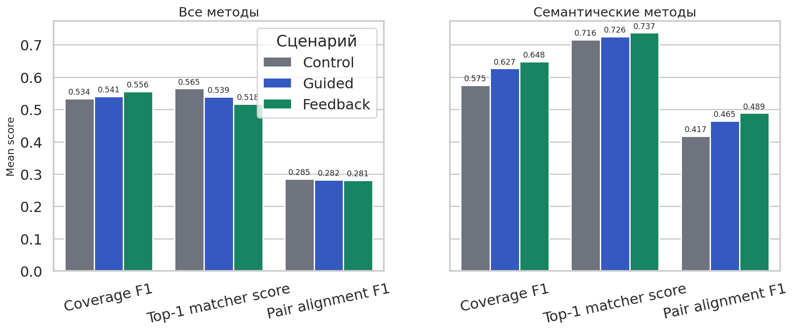
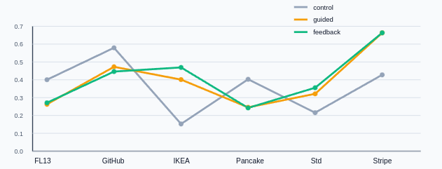

## Резюме

В статье исследуется применение LSP-подобной семантической обратной связи при генерации формальных C#-моделей, используемых как промежуточное представление нормативных и технических описаний. Проблема состоит в том, что независимо сгенерированные модели могут быть синтаксически корректными, но плохо сопоставимыми из-за различий в именовании сущностей, ролей, единиц измерения и связей. Новизна работы заключается в проверке семантического статического анализа как слоя нормализации моделей до межмодельного выравнивания. Эксперимент выполнен на шести документах, трёх генераторных моделях и трёх сценариях: контрольном, с инструкциями и с итеративной обратной связью. Получено 54 артефакта, 432 направленные пары и 298 745 кандидатов сопоставления.

**Цель** – оценить, повышают ли рекомендации по именованию и выражению ролей выравниваемость сгенерированных доменных моделей.

**Методология**: использованы экспериментальное моделирование, автоматическое выравнивание схем, сравнительный анализ метрик `coverage_f1`, `top1_mean_score` и `pair_alignment_f1`, а также оценка качества схем.

**Результаты:** установлено, что эффект зависит от алгоритма выравнивания: при усреднении по всем методам рост неоднороден, но для семантически и структурно чувствительных алгоритмов `pair_alignment_f1` увеличивается на 17,1%. Для `valentine:coma_py` во всех направленных парах наблюдается порядок `control < guided < feedback`.

**Область применения результатов**: результаты могут использоваться при разработке инструментов генерации формальных моделей, средств статического анализа и систем поиска противоречий в документах.

**Ключевые слова**: семантическая обратная связь; формальные модели; межмодельное выравнивание; статический анализ; генеративные модели.

## Summary

The article studies the use of LSP-like semantic feedback in the generation of formal C# models used as an intermediate representation of regulatory and technical descriptions. The problem is that independently generated models may be syntactically valid, yet poorly comparable because of differences in naming entities, roles, units of measurement, and structural relations. The novelty of the work is the evaluation of semantic static analysis as a normalization layer before model-to-model alignment. The experiment is based on six heterogeneous documents, three generative models, and three scenarios: control, extended instructions, and iterative feedback. The study produced 54 artifacts, 432 directed alignment pairs, and 298,745 alignment candidates.

**Purpose** – to determine whether recommendations on naming and explicit representation of semantic roles improve the alignability of independently generated domain models.

**Methodology**: the study uses experimental modeling, automated schema alignment, comparative analysis of `coverage_f1`, `top1_mean_score`, and `pair_alignment_f1`, and a heuristic assessment of schema quality.

**Results:** the effect depends on the alignment algorithm. Averaging across all methods gives a heterogeneous result, while semantic and structure-sensitive algorithms show a 17.1% increase in `pair_alignment_f1`. For `valentine:coma_py`, all directed model pairs follow the order `control < guided < feedback`.

**Practical implications**: the results can be used in tools for generating formal models, semantic static analyzers, and systems for detecting contradictions in regulatory documents.

**Keywords**: semantic feedback; formal models; model alignment; static analysis; generative models.

## 1. Введение

Автоматический поиск противоречий в нормативных документах требует перехода от естественного языка к формальному представлению [@prokazin-ddl-ltlf; @nute-defeasible-deontic-logic]. Однако формальная грамматика и логический вывод не устраняют все инженерные проблемы. Нормативные документы создаются разными организациями, в разное время и в разных терминологических традициях. При независимом переводе таких документов в формальный язык разные авторы могут использовать разные имена для одних и тех же сущностей, одинаковые имена для разных сущностей, разные уровни детализации и разные способы представления единиц измерения, ролей и состояний. Поэтому два фрагмента текста на формальном языке могут быть корректными по отдельности, но плохо сопоставляться между собой.

При анализе больших массивов документов эта проблема становится ещё более значимой. Так как сопоставление формальных моделей нельзя выполнять вручную попарно, требуется массовое межмодельное выравнивание, то есть автоматическое нахождение соответствий между типами, свойствами, отношениями и другими элементами моделей [@rahm-bernstein-schema-matching-2001; @shvaiko-euzenat-ontology-matching-2013]. Стандарты обмена требованиями, например ReqIF, решают задачу переноса артефактов между инструментами, но не устраняют проблему семантической несогласованности моделей [@omg-reqif-1-2; @teremov-prokazin-rusreqif]. Обычно такую задачу решают с помощью алгоритмов выравнивания моделей. В данной статье рассматривается фаза подготовки данных перед выравниванием моделей, а конкретно возможность на этапе написания или генерации формального кода сделать модели более пригодными для последующего выравнивания.

Предлагаемый подход состоит в уточнении семантики неформальных элементов исходного кода. Грамматика языка задаёт структуру выражений, но не полностью определяет, как должны называться типы, поля, перечисления, функции и связи. Между тем имена часто несут семантическую информацию, используемую алгоритмами выравнивания. Поэтому статический анализ кода может учитывать не только синтаксис, но и качество имён: их предметность, однозначность, согласованность и связь с единицами измерения или ролями.

Такой анализ удобно реализовать в виде языкового сервера. Редактор или IDE получает диагностики, предупреждения и рекомендации, а автор исправляет модель до передачи её на следующий этап [@microsoft-lsp-3-17]. В настоящем эксперименте промышленный LSP-сервер не реализовывался. Вместо него использовалась LSP-подобная процедура обратной связи, имитирующая предупреждения языкового сервера. Это позволяет проверить принцип без построения полной инструментальной инфраструктуры.

## 2. Постановка задачи и гипотеза

Прикладная задача состоит в поиске противоречий в нормативных документах. Для её решения нужно выполнить три операции: перевести фрагменты документов в формальный промежуточный язык, сопоставить элементы моделей, полученных из разных документов, и применить алгоритмы логического анализа для выявления конфликтов между нормами.

Пусть один исходный документ преобразуется в несколько доменных моделей разными генераторными моделями. Если эти модели описывают одну и ту же предметную область, их элементы должны быть сопоставимы. На практике одна модель может содержать свойство `WeightKg`, другая `Mass`, третья `ProductWeight`, а четвёртая `Value`. C#-код при этом может оставаться синтаксически допустимым [@ecma-csharp-334-2023], но автоматическое сопоставление элементов становится менее надёжным.

Проверяемая гипотеза формулируется так: семантическая обратная связь по именованию и структуре элементов повышает выравниваемость независимо сгенерированных доменных моделей. Выравниваемость здесь понимается как способность алгоритмов schema/model alignment находить больше корректных или правдоподобных соответствий между элементами моделей.

## 3. Методика эксперимента

### 3.1. Исходный корпус

Table: Исходный корпус

| Документ | Строк | Слов | Символов |
|---|---:|---:|---:|
| `framework-laptop-13-specs` | 21 | 480 | 2 752 |
| `github-create-issue-api` | 28 | 453 | 3 037 |
| `ikea-billy-manual` | 45 | 613 | 3 710 |
| `king-arthur-pancakes` | 30 | 412 | 2 419 |
| `standard-fragment` | 23 | 700 | 4 123 |
| `stripe-payment-intent` | 42 | 580 | 4 549 |

### 3.2. Генераторные модели и сценарии

Для генерации C#-моделей использовались три модели:

- gemini-2.5-flash-lite
- llama-3.2-3b-instruct
- ministral-3b-2512

Для каждого документа и каждой модели запускались три сценария:

Table: Сценарии генерации моделей

| Сценарий | Описание |
|---|---|
| `control` | Прямая генерация C#-доменной модели по исходному документу без дополнительной обратной связи. |
| `guided` | Генерация с расширенной инструкцией по структурированию и семантическому именованию элементов модели. |
| `feedback` | Сначала выполняется guided-генерация. Затем отдельная модель-рецензент анализирует полученный C#-файл и выдаёт LSP-подобные предупреждения. После этого исходная модель вносит исправления. |

В сценарии `feedback` модель-рецензент не видела исходный документ. Предупреждения могли касаться слишком общих имён, отсутствия единиц измерения в числовых полях, смешения синонимов, дублирования семантических ролей, неявных состояний и неоднозначных типов. Такой дизайн близок к итеративным схемам генерации, обратной связи и уточнения результата в LLM-системах [@madaan-self-refine-2023].

Таким образом, было получено 54 артефакта для оценки выравнивания.
Из этих моделей, для выравнивания получено 432 направленные пары, 298 745 кандидатов выравнивания и 13 165 оценённых срезов пар.

### 3.3. Алгоритмы выравнивания

В эксперимент включено 11 конфигураций алгоритмов выравнивания из трёх источников: Valentine, BDI-Kit и Magneto [@koutras-valentine-2021; @lopez-bdikit-demo-2026; @liu-magneto-2025].

Часть используемых конфигураций восходит к классическим подходам Similarity Flooding, Cupid и COMA/COMA++ [@melnik-similarity-flooding-2002; @madhavan-cupid-2001; @aumueller-coma-2005].

Наибольший объём кандидатов дали следующие конфигурации:

Table: Конфигурации выравнивания давшие наибольшее число кандидатов

| Конфигурация | Кандидатов |
|---|---:|
| `magneto:native_zero_download` | 101 055 |
| `bdikit:jaccard_distance` | 36 275 |
| `bdikit:similarity_flooding` | 36 275 |
| `bdikit:coma` | 33 552 |
| `valentine:similarity_flooding` | 26 988 |

### 3.4. Метрики

Основные метрики эксперимента:

- `source_coverage`: доля элементов исходной модели, участвующих хотя бы в одном кандидате на сопоставление;
- `target_coverage`: доля элементов целевой модели, участвующих хотя бы в одном кандидате на сопоставление;
- `coverage_f1`: гармоническое среднее между `source_coverage` и `target_coverage`;
- `top1_mean_score`: средняя метрика лучшего кандидата для каждого элемента источника;
- `pair_alignment_f1`: комбинированная метрика, равная произведению `coverage_f1` и `top1_mean_score`.

$$
\operatorname{coverage\_f1} =
\frac{2 \cdot \operatorname{source\_coverage} \cdot \operatorname{target\_coverage}}
{\operatorname{source\_coverage} + \operatorname{target\_coverage}}.
$$

$$
\operatorname{pair\_alignment\_f1} =
\operatorname{coverage\_f1} \cdot \operatorname{top1\_mean\_score}.
$$

Таким образом, `coverage_f1` показывает, какая часть структуры модели может быть вовлечена в выравнивание. `top1_mean_score` сильнее зависит от уверенности алгоритма выравнивания в лучшем кандидате и часто чувствителен к поверхностному сходству имён. `pair_alignment_f1` объединяет оба аспекта, поэтому данная метрика может скрывать ситуацию, когда структурное покрытие растёт, а лексическая похожесть снижается.

## 4. Результаты

### 4.1. Синтаксическое качество сгенерированного кода

Перед анализом alignment-метрик необходимо учесть синтаксическое качество C#-артефактов. Контрольный сценарий не дал ошибок парсинга, guided-сценарий дал 4 ошибки, feedback-сценарий дал 41 ошибку.

Table: Распределение ошибок по сценариям

| Сценарий | Сумма ошибок парсинга | Среднее | Максимум | Доля артефактов без ошибок |
|---|---:|---:|---:|---:|
| `control` | 0 | 0.000 | 0 | 1.000 |
| `guided` | 4 | 0.222 | 2 | 0.889 |
| `feedback` | 41 | 2.278 | 17 | 0.833 |

Основной источник риска связан с моделью `llama-3.2-3b-instruct`: на неё пришлось 43 ошибки парсинга из 45. Gemini не дала ошибок, Ministral дала 2 ошибки. Следовательно, обратная связь может улучшать показатели выравнивания и одновременно ухудшать синтаксическую устойчивость отдельных генераторных моделей.

### 4.2. Общий результат по всем методам

При агрегации всех методов выравнивания не наблюдается устойчивого улучшения метрик, Однако при выборке по чувствительным к семантике алгоритмам очевиден рост качества выравнивания (рис. 1)

Этот результат показывает, что обратная связь повышает выравниваемость при оценке методами, чувствительными к структурной и семантической согласованности, а не только к поверхностному совпадению идентификаторов.

### 4.3. Конфигурация `valentine:coma_py`

Наиболее согласованный результат получен для конфигурации `valentine:coma_py`. При агрегации по всем документам и слоям проекции каждая направленная пара генераторных моделей даёт один и тот же порядок:

$$
\operatorname{control} < \operatorname{guided} < \operatorname{feedback}.
$$

Table: Прирост метрик при ужесточении семантики

| Исходная модель | Целевая модель | `control` | `guided` | `feedback` |
|---|---|---:|---:|---:|
| Gemini | Llama | 0.3182 | 0.3557 | 0.3684 |
| Gemini | Ministral | 0.4351 | 0.4808 | 0.4899 |
| Llama | Gemini | 0.3182 | 0.3557 | 0.3684 |
| Llama | Ministral | 0.3409 | 0.3459 | 0.3992 |
| Ministral | Gemini | 0.4351 | 0.4808 | 0.4903 |
| Ministral | Llama | 0.3244 | 0.3459 | 0.3992 |

Такое распределение снижает вероятность того, что эффект вызван одной удачной парой моделей или одним направлением выравнивания.

### 4.4. Различия между документами

Эффект обратной связи неоднороден по исходным документам (рис. 2).

Из этого следует, что обратная связь не обеспечивает универсального улучшения для любого типа текста. Вероятно, её эффект зависит от исходной структурированности документа, плотности терминологии, числа единиц измерения, наличия процедурных шагов и того, насколько генераторные модели уже знакомы с данным типом описания.

### 4.6. Сравнение алгоритмов выравнивания

Наибольшие положительные разницы между сценарием с обратной связью и статическими инструкциями получены для следующих конфигураций:

Table: Наибольшие положительные разницы

| Алгоритм выравнивания | `feedback - guided` |
|---|---:|
| `valentine:distribution_based` | +0.0878 |
| `valentine:coma_py` | +0.0264 |
| `bdikit:coma` | +0.0201 |
| `bdikit:cupid` | +0.0189 |

Table: Наибольшие отрицательные разницы

| Алгоритм выравнивания | `feedback - guided` |
|---|---:|
| `bdikit:jaccard_distance` | -0.0385 |
| `valentine:jaccard_distance` | -0.0372 |
| `bdikit:distribution_based` | -0.0290 |
| `valentine:cupid` | -0.0239 |

Такая картина подтверждает гипотезу о том что обратная связь положительно сказывается именно на качестве структурных и семантически чувствительных алгоритмах выравнивания, и может ухудшать показатели в алгоритмах основанных на лексическом совпадении.

### 4.7. Внутренняя оценка качества схем

Вспомогательной проверкой был эвристический `semantic_quality_index`. Он не является основной метрикой выравнивания, но показывает, становятся ли модели более явными с точки зрения внутреннего именования и структуры.

Средние значение `semantic_quality_index` для группы `control` составило 0.4532, для `guided` - 0.5070, `feedback` - 0.5565.

Индекс растёт монотонно. Относительный прирост `feedback` относительно контроля составляет около 22.8%. Это поддерживает предположение, что обратная связь улучшает явность схемы. Основной вывод, однако, должен оставаться alignment-ориентированным: внутреннее качество важно настолько, насколько оно повышает способность моделей выравниваться между собой.

## Заключение

Проведённый эксперимент показывает, что семантическая обратная связь может повышать выравниваемость независимо сгенерированных моделей, особенно в срезах, где алгоритмы выравнивания учитывают структуру и контекст. Для таких алгоритмов метрика `pair_alignment_f1` показала рост с 0.4172 до 0.4886, что соответствует относительному приросту 17.1%. Наблюдаемый эффект статистически отличался от нуля (p = 0.00014, permutation test; 95% ДИ для относительного прироста: от 8.2% до 26.8%). Для `valentine:coma_py` во всех направленных парах наблюдался порядок `control < guided < feedback`.  Это подтверждает исходную гипотезу в уточнённой форме: семантические рекомендации по именованию и явному выражению ролей делают модели более пригодными для межмодельного выравнивания, хотя могут снижать поверхностную лексическую похожесть.

Вместе с тем полученные результаты следует рассматривать как основу для дальнейшего расширения исследования. Эксперимент был ориентирован на первичную проверку принципа, поэтому следующий этап связан с увеличением корпуса документов, числа генераторных моделей и количества запусков. Также требуется дополнить оценку межмодельного согласия метриками соответствия исходному документу и развить feedback-сценарий до полноценного инструмента статического анализа с синтаксическим контролем. Это позволит связать улучшение выравниваемости моделей с конечной задачей — более надёжным выявлением нормативных противоречий.

Исходные материалы, алгоритмы и результаты исследования опубликованы [@github].

## Список литературы

::: {#refs}
:::
