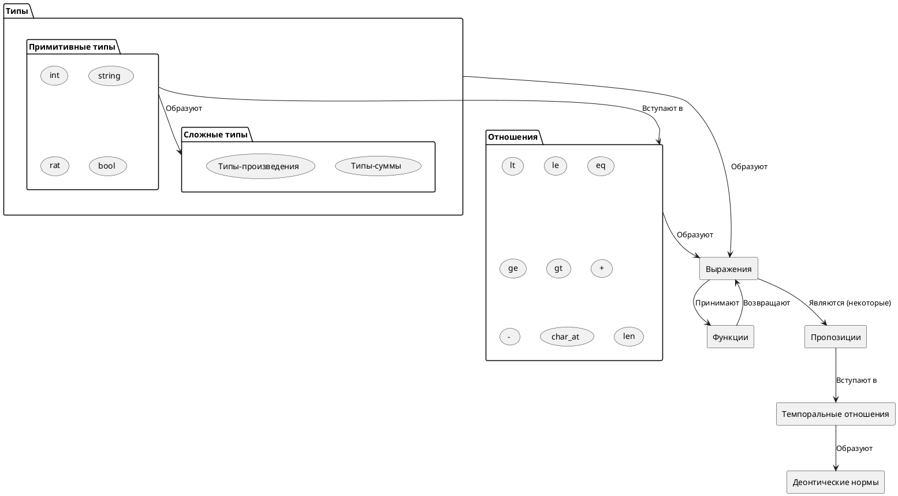

# Заметки к статье

Основная суть - язык в духе пролога, но с DDL-LTLf семантикой и встроенным 
механизмом model alignment.

Структура языка

```plantuml
@startuml
' left to right direction

package "Отношения" as relations {
    usecase "lt"
    usecase "le"
    usecase "eq"
    usecase "ge"
    usecase "gt"
    usecase "+"
    usecase "-"
    usecase "char_at"
    usecase "len"
}
package "Типы" as types {
    package "Примитивные типы" as primitives {
        usecase "int" 
        usecase "string"
        usecase "rat"
        usecase "bool"
    }
    package "Сложные типы" as composites {
        usecase "Типы-суммы"
        usecase "Типы-произведения"
    }
    primitives --> composites : Образуют
}

rectangle "Выражения" as expressions
rectangle "Функции" as functions
rectangle "Пропозиции" as vars
rectangle "Темпоральные отношения" as ltl
rectangle "Деонтические нормы" as rules

primitives --> relations : Вступают в
relations --> expressions : Образуют
types --> expressions : Образуют
expressions --> functions : Принимают
functions -->  expressions : Возвращают
expressions --> vars : Являются (некоторые)
vars --> ltl : Вступают в 
ltl --> rules : Образуют

@enduml
```