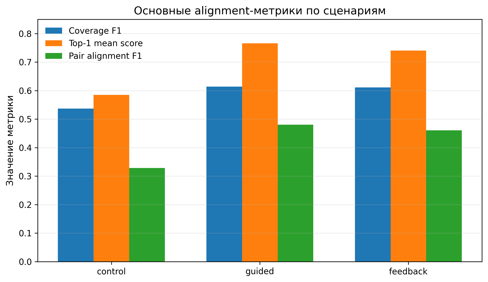
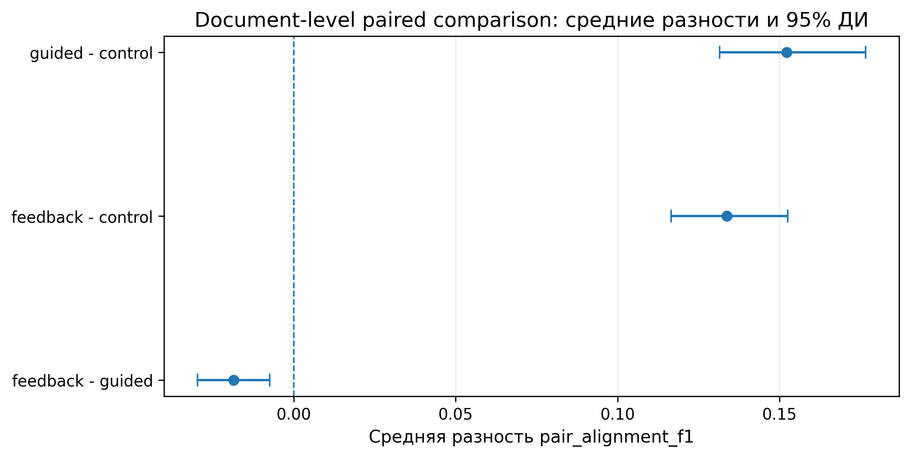
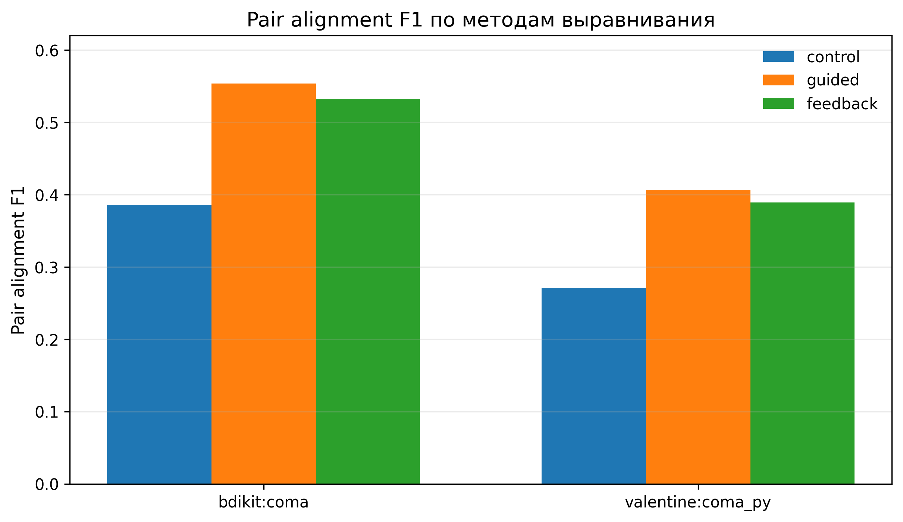
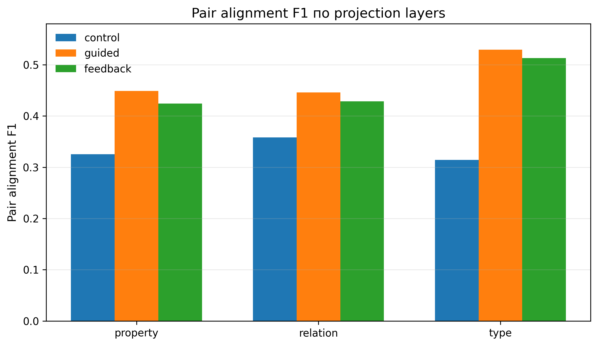
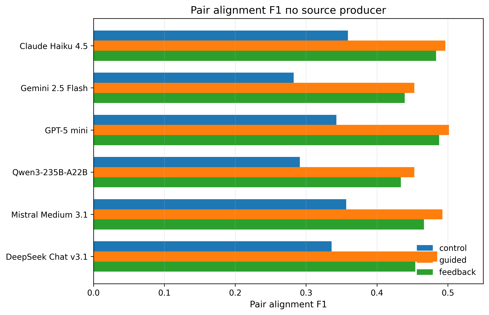
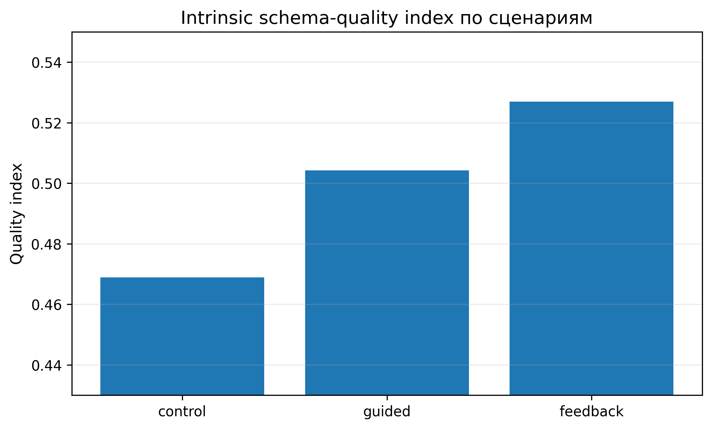
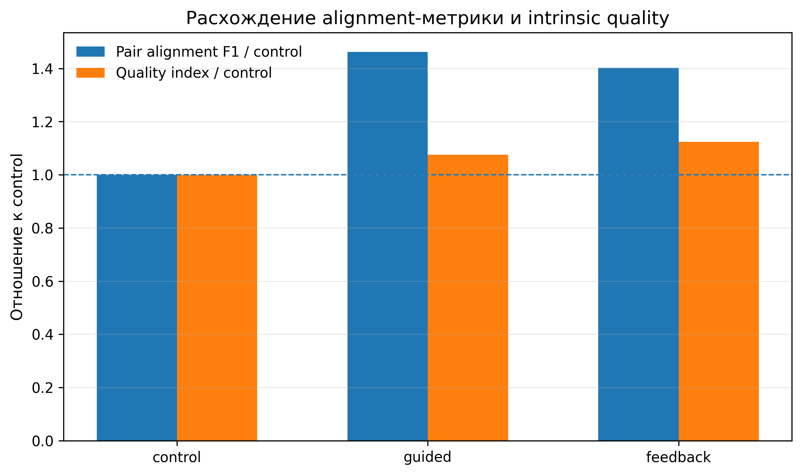

## Резюме

В статье исследуется влияние различных prompting-сценариев на выравниваемость формальных C#-моделей, сгенерированных большими языковыми моделями по техническим спецификациям. Проблема состоит в том, что независимо сгенерированные модели могут быть синтаксически корректными и содержательно близкими, но плохо сопоставимыми из-за различий в именовании сущностей, ролей, состояний, связей и единиц измерения. В отличие от предварительной проверки на малом корпусе, настоящее исследование выполнено на корпусе из 32 RFC-документов, шести генераторных моделей и пяти независимых запусков для каждой комбинации документа, модели и сценария. Всего получено 2880 C#-артефактов, извлечено 115 614 элементов схем, построено 14 400 направленных межмодельных пар и запланировано 86 400 операций выравнивания с использованием двух COMA-подобных методов: `valentine:coma_py` и `bdikit:coma`.

**Цель** -- оценить, как прямая генерация, структурированные инструкции и LSP-подобная семантическая обратная связь влияют на измеряемую автоматическими schema matchers межмодельную выравниваемость C#-моделей.

**Методология**: использованы экспериментальное моделирование, Roslyn-based извлечение элементов схем, табличные проекции типов, свойств и отношений, автоматическое выравнивание схем, сравнительный анализ метрик `coverage_f1`, `top1_mean_score` и `pair_alignment_f1`, а также вспомогательная эвристическая оценка внутреннего качества схем.

**Результаты:** structured guided prompting и feedback-ревизия существенно превосходят прямую генерацию по основной alignment-метрике. Значение `pair_alignment_f1` возрастает с 0,3286 в `control` до 0,4803 в `guided` и 0,4609 в `feedback`, что соответствует относительному приросту 46,2% и 40,3% относительно `control`. При этом `feedback` не превосходит `guided` по основной matcher-based метрике: разность `feedback - guided` составляет -0,0193, или -4,0%. На уровне документов `guided` и `feedback` превосходят `control` во всех 32 случаях, тогда как `feedback` превосходит `guided` только в 9 из 32 документов. В то же время `feedback` даёт лучший результат по вспомогательному intrinsic schema-quality index: 0,5270 против 0,5042 у `guided` и 0,4689 у `control`.

**Область применения результатов**: результаты могут использоваться при разработке инструментов генерации формальных моделей, статического анализа, межмодельного выравнивания и подготовки промежуточных представлений для анализа технических и нормативных документов.

**Ключевые слова**: большие языковые модели; формальные модели; C#; межмодельное выравнивание; schema matching; COMA; семантическая обратная связь; prompting; RFC.

## Summary

The paper investigates how different prompting scenarios affect the alignability of formal C# domain models generated by large language models from technical specifications. Independently generated models may be syntactically valid and semantically related, yet difficult to align because of differences in naming entities, roles, states, relations, and measurement units. Unlike preliminary small-scale experiments, this study uses a corpus of 32 RFC documents, six generator models, and five independent runs for each document-model-scenario combination. The experiment produced 2,880 C# artifacts, 115,614 extracted schema elements, 14,400 directed cross-model pairs, and 86,400 scheduled alignment operations using two COMA-like matchers: `valentine:coma_py` and `bdikit:coma`.

**Purpose** -- to evaluate how direct generation, structured guided prompting, and LSP-like semantic feedback affect the cross-model alignability of generated C# domain models as measured by automated schema matchers.

**Methodology**: the study uses experimental modeling, Roslyn-based schema element extraction, tabular projections of types, properties, and relations, automated schema alignment, comparative analysis of `coverage_f1`, `top1_mean_score`, and `pair_alignment_f1`, and an auxiliary heuristic assessment of intrinsic schema quality.

**Results:** structured guided prompting and feedback revision both substantially outperform direct generation on the primary alignment metric. `pair_alignment_f1` increases from 0.3286 in `control` to 0.4803 in `guided` and 0.4609 in `feedback`, which corresponds to relative improvements of 46.2% and 40.3% over `control`. However, `feedback` does not outperform `guided` on the primary matcher-based metric: the `feedback - guided` difference is -0.0193, or -4.0%. At the document level, both `guided` and `feedback` outperform `control` in all 32 documents, whereas `feedback` outperforms `guided` in only 9 out of 32 documents. A separate intrinsic schema-quality analysis shows a different pattern: `feedback` achieves the highest quality index, 0.5270 compared with 0.5042 for `guided` and 0.4689 for `control`.

**Practical implications**: the results can be used in tools for generating formal models, semantic static analyzers, model alignment systems, and pipelines that prepare intermediate representations for analyzing technical and regulatory documents.

**Keywords**: large language models; formal models; C#; model alignment; schema matching; COMA; semantic feedback; prompting; RFC.

## 1. Введение

Автоматический анализ технических и нормативных документов требует перехода от естественного языка к формальному промежуточному представлению. Такое представление может использоваться для поиска противоречий, проверки совместимости требований, построения трассируемости и последующей логической обработки. В задачах нормативного анализа этот переход особенно важен, поскольку противоречие между требованиями не всегда выражено поверхностно: оно может возникать из сочетания обязанностей, запретов, условий, исключений и временных ограничений [@prokazin-ddl-ltlf; @nute-defeasible-deontic-logic].

Однако формальная корректность отдельной модели не гарантирует её сопоставимости с другими моделями. При независимом переводе одного и того же документа в формальный язык разные авторы или разные генераторные модели могут выбирать разные имена для одних и тех же сущностей, использовать разные уровни детализации, по-разному выражать роли, состояния, единицы измерения и связи. Поэтому два C#-файла могут быть синтаксически корректными по спецификации языка [@ecma-csharp-334-2023], но плохо сопоставляться автоматическими алгоритмами выравнивания.

При анализе больших массивов документов эта проблема становится инженерно значимой. Сопоставление формальных моделей нельзя выполнять вручную попарно: требуется массовое межмодельное выравнивание, то есть автоматическое нахождение соответствий между типами, свойствами, отношениями и другими элементами моделей. Такая задача связана с областью schema matching и ontology matching [@rahm-bernstein-schema-matching-2001; @shvaiko-euzenat-ontology-matching-2013]. В смежных инженерных задачах стандарты обмена требованиями, например ReqIF, решают задачу переноса артефактов между инструментами, но не устраняют проблему семантической несогласованности моделей [@omg-reqif-1-2; @teremov-prokazin-rusreqif].

В настоящей работе рассматривается не сам логический вывод и не экспертная проверка истинности модели относительно исходного текста, а более узкая и измеримая задача: как prompting-сценарий влияет на cross-model schema alignability, то есть на способность автоматических schema matchers сопоставлять элементы C#-моделей, независимо сгенерированных разными большими языковыми моделями по одному документу.

Ранее проверялась идея LSP-подобной семантической обратной связи: сгенерированный C#-код анализируется не только на уровне синтаксиса, но и на уровне именования, явности ролей, единиц измерения и структурной согласованности. Аналогия с Language Server Protocol связана с тем, что языковой сервер может возвращать диагностики, предупреждения и рекомендации для редактора или IDE [@microsoft-lsp-3-17]. В данной работе промышленный LSP-сервер не реализуется; используется LSP-подобная процедура, имитирующая слой семантических диагностик и последующей ревизии результата.

Ключевое отличие расширенного эксперимента от предварительной проверки состоит в масштабе и в более строгой постановке сравнения. Использован корпус из 32 RFC-документов, шесть генераторных моделей, три сценария генерации и пять независимых запусков. Выравнивание выполняется только внутри одинаковых значений документа, сценария и номера запуска между разными producer-моделями. Это позволяет отделить межмодельные различия от вариативности повторных запусков и не смешивать разные сценарии непосредственно на стадии alignment.

Основной результат статьи состоит в следующем. Структурированные guided-инструкции и feedback-ревизия оба существенно улучшают измеряемую межмодельную выравниваемость относительно прямой генерации. Однако feedback-ревизия не превосходит guided prompting по основной matcher-based метрике `pair_alignment_f1`. При этом feedback даёт лучший результат по вспомогательной intrinsic schema-quality эвристике, отражающей специфичность идентификаторов и явность схемы. Следовательно, в эксперименте обнаруживается расхождение между двумя видами качества: пригодностью к автоматическому выравниванию и внутренней явностью модели.

Вклад статьи состоит в следующем:

1. предложен масштабированный протокол оценки cross-model alignability для LLM-сгенерированных C#-моделей;
2. проведено сравнение трёх prompting-сценариев на корпусе из 32 RFC-документов, шести генераторных моделей и пяти независимых запусков;
3. показано, что structured guided prompting является лучшим сценарием по основной alignment-метрике, тогда как feedback-ревизия лучше по intrinsic schema-quality index;
4. проанализирована устойчивость результата по документам, alignment methods, projection layers и producer-моделям;
5. уточнена роль семантической обратной связи: она повышает явность формальных моделей, но не обязательно максимизирует оценки unsupervised schema matchers.

## 2. Связанные работы и контекст исследования

### 2.1. Формальные модели технических и нормативных описаний

Формализация требований и нормативных описаний обычно предполагает выделение объектов предметной области, условий, ролей, состояний и ограничений. В прикладных сценариях такая формализация нужна не сама по себе, а как промежуточный слой для последующей обработки: проверки согласованности, поиска конфликтов, построения зависимостей и генерации исполнимых или проверяемых артефактов. В задачах нормативного анализа близкую роль играют деонтические и defeasible-логики, позволяющие описывать обязанности, разрешения, запреты и исключения [@nute-defeasible-deontic-logic].

В настоящей работе C# используется не как целевая платформа исполнения, а как структурированный промежуточный язык. C#-модель может содержать типы, свойства, перечисления и отношения, которые затем извлекаются как элементы схемы. Такой выбор удобен по двум причинам. Во-первых, синтаксис C# достаточно строг и может быть проверен стандартными средствами. Во-вторых, имена типов, свойств и перечислений сохраняют богатую предметную информацию, важную для последующего выравнивания.

### 2.2. Schema matching и межмодельное выравнивание

Schema matching направлен на поиск соответствий между элементами двух схем: таблицами, атрибутами, типами, свойствами или отношениями. Классический обзор подходов к автоматическому сопоставлению схем представлен в работе Rahm и Bernstein [@rahm-bernstein-schema-matching-2001]. Близкая область ontology matching рассматривает сопоставление классов, свойств и экземпляров онтологий [@shvaiko-euzenat-ontology-matching-2013].

Для данной работы важны методы, учитывающие не только локальное сходство имён, но и структуру модели. COMA/COMA++ относится к классическим системам комбинированного schema and ontology matching [@aumueller-coma-2005]. Другие известные подходы, такие как Similarity Flooding и Cupid, также используют сочетание лексических и структурных признаков [@melnik-similarity-flooding-2002; @madhavan-cupid-2001]. В современных экспериментальных средах эти методы представлены через библиотеки и toolkit-реализации. В настоящем эксперименте используются две COMA-подобные реализации: `valentine:coma_py` из Valentine [@koutras-valentine-2021] и `bdikit:coma` из BDI-Kit [@lopez-bdikit-demo-2026].

Отдельно развивается линия работ, где большие языковые модели используются как часть schema matching pipeline или для повышения качества сопоставления [@liu-magneto-2025]. Настоящая работа отличается тем, что LLM применяются не как matcher, а как генераторы формальных C#-моделей, которые затем сопоставляются классическими unsupervised matchers.

### 2.3. Prompting, feedback и итеративное уточнение

Итеративное уточнение ответа модели по обратной связи является распространённой схемой в LLM-системах. Self-Refine и близкие подходы показывают, что модель или внешний рецензент может анализировать промежуточный результат и затем улучшать его в следующем шаге [@madaan-self-refine-2023]. Для генерации формальных моделей такая схема выглядит естественно: сначала модель создаёт код, затем анализатор или другая модель формирует замечания, после чего исходная модель выполняет revision.

Однако улучшение результата в одном смысле не обязательно означает улучшение всех downstream-метрик. Для человека более явная схема может быть удобнее: идентификаторы становятся длиннее, роли -- конкретнее, единицы измерения -- явнее. Но для автоматического schema matcher такая спецификация может оказаться менее выгодной, если разные генераторные модели выбирают разные уточняющие признаки и тем самым снижают поверхностное сходство имён. Поэтому feedback следует оценивать отдельно по двум измерениям: межмодельной выравниваемости и внутренней явности схемы.

## 3. Постановка задачи и исследовательские вопросы

Пусть исходный документ $d$ преобразуется генераторной моделью $m$ в C#-модель при сценарии $s$ и номере независимого запуска $r$. Обозначим результат генерации как

$$
G(d,m,s,r).
$$

Для двух различных генераторных моделей $m_i$ и $m_j$ требуется оценить, насколько хорошо элементы моделей $G(d,m_i,s,r)$ и $G(d,m_j,s,r)$ сопоставляются алгоритмом выравнивания. Важно, что сравнение выполняется только при одинаковых $d$, $s$ и $r$. Это означает, что модели сравниваются внутри одного документа, одного сценария и одного номера запуска, но между разными producer-моделями.

В данной работе не оценивается ручная semantic correctness модели относительно исходного RFC и не проверяется downstream-поведение сгенерированного кода. Основная измеряемая величина -- cross-model schema alignability: насколько элементы формальных моделей могут быть сопоставлены автоматическими schema matchers.

Исследовательские вопросы сформулированы следующим образом.

**RQ1.** Улучшает ли structured guided prompting межмодельную выравниваемость C#-моделей относительно прямой генерации?

**RQ2.** Улучшает ли feedback-ревизия межмодельную выравниваемость относительно прямой генерации?

**RQ3.** Превосходит ли feedback-ревизия structured guided prompting по основной matcher-based alignment-метрике?

**RQ4.** Улучшает ли feedback-ревизия внутреннюю явность схемы, измеряемую вспомогательным intrinsic schema-quality index?

**RQ5.** Насколько устойчивы наблюдаемые эффекты по документам, alignment methods, projection layers и producer-моделям?

Такая постановка специально разделяет два результата, которые легко смешать. Первый результат -- это качество выравнивания в смысле unsupervised matchers. Второй -- качество внутренней схемной явности, полезное для читаемости и последующей экспертной работы, но не обязательно совпадающее с matcher-based score.

## 4. Методика эксперимента

### 4.1. Корпус документов

В качестве корпуса использованы 32 RFC-документа. В настоящей работе RFC рассматриваются как корпус технических спецификаций и документов стандартизационного характера. Не все RFC имеют одинаковый нормативный статус: серия RFC включает разные типы документов, включая standards track, best current practice, experimental и informational документы [@rfc2026]. Для целей настоящего исследования это не является недостатком, поскольку задача состоит не в юридической классификации RFC, а в проверке генерации и выравнивания моделей на технических текстах с высокой плотностью терминов, ролей, состояний и ограничений.

Table: Характеристики корпуса RFC

| Метрика | Значение |
|---|---:|
| Документов | 32 |
| Всего строк в исходных документах | 30 714 |
| Всего слов в исходных документах | 156 985 |
| Среднее слов на документ | 4 905,8 |
| Медиана слов на документ | 4 327 |
| Минимум / максимум слов на документ | 1 737 / 14 595 |

Корпус существенно крупнее предварительной выборки и включает документы различной длины. Это позволяет оценивать не только средний эффект prompting-сценария, но и его устойчивость на неоднородных технических спецификациях.

### 4.2. Генераторные модели и сценарии

В эксперимент включены шесть генераторных моделей:

- `anthropic/claude-haiku-4.5`;
- `deepseek/deepseek-chat-v3.1`;
- `google/gemini-2.5-flash`;
- `mistralai/mistral-medium-3.1`;
- `openai/gpt-5-mini`;
- `qwen/qwen3-235b-a22b`.

Для каждой комбинации документа, модели и сценария выполнялось пять независимых запусков. Рассматривались три сценария генерации.

Table: Сценарии генерации C#-моделей

| Сценарий | Описание |
|---|---|
| `control` | Прямая генерация C#-доменной модели из исходного документа. |
| `guided` | Генерация с использованием структурированных guided prompt templates, задающих правила именования, структурирования и представления элементов модели. |
| `feedback` | Сначала выполняется guided-генерация; затем отдельный feedback pass анализирует C#-файл; после этого исходная generator-модель выполняет revision. |

Сценарий `feedback` является LSP-подобным, но не является реализацией промышленного LSP-сервера. Feedback pass имитирует диагностический слой: он выявляет слишком общие имена, неявные роли, отсутствие единиц измерения, смешение синонимов, неоднозначные типы и другие признаки, потенциально затрудняющие дальнейшее выравнивание. Затем исходная модель получает эти замечания и формирует исправленную версию C#-артефакта.

Матрица эксперимента задаётся следующими величинами:

$$
D = 32, \quad M = 6, \quad S = 3, \quad R = 5,
$$

где $D$ -- число документов, $M$ -- число генераторных моделей, $S$ -- число сценариев, $R$ -- число независимых запусков. Число итоговых inference artifacts равно

$$
N_{\text{artifacts}} = D \cdot M \cdot S \cdot R
= 32 \cdot 6 \cdot 3 \cdot 5
= 2880.
$$

Все 2880 inference records завершились со статусом `completed`.

### 4.3. Извлечение элементов схем и проекции

После генерации C#-файлов выполнялось Roslyn-based извлечение schema elements из каждого `final.cs`. Извлекались элементы четырёх типов: `enum member`, `property`, `relation` и `type`. Далее для выравнивания строились табличные projection CSV по трём слоям.

Table: Projection layers

| Layer | Projection mode |
|---|---|
| `property` | `path_only` |
| `type` | `members_as_values` |
| `relation` | `path_plus_metadata_values` |

Разделение на layers нужно потому, что разные элементы модели несут разную информацию. Свойства сильнее зависят от имён и путей, типы -- от состава members, а отношения -- от сочетания пути и метаданных. Поэтому aggregate score по всем layers дополняется отдельным анализом чувствительности к projection layer.

### 4.4. Протокол выравнивания

Выравнивание строилось только внутри одинаковых значений `document`, `scenario` и `run-index`. Разные сценарии напрямую друг с другом не выравнивались. Это важное ограничение дизайна: headline-сравнения сценариев основаны на same-scenario aggregates, а не на прямом cross-scenario alignment.

Для каждого блока `document/scenario/run` строились направленные cross-producer pairs без self-pairs. При шести producer-моделях число таких направленных пар равно

$$
M(M-1) = 6 \cdot 5 = 30.
$$

Итоговое число направленных пар моделей:

$$
N_{\text{pairs}} = D \cdot S \cdot R \cdot M(M-1)
= 32 \cdot 3 \cdot 5 \cdot 6 \cdot 5
= 14400.
$$

Для каждой пары выполнялось выравнивание по трём projection layers и двум методам. Полный workload составил

$$
N_{\text{ops}} = N_{\text{pairs}} \cdot L \cdot A
= 14400 \cdot 3 \cdot 2
= 86400,
$$

где $L=3$ -- число projection layers, $A=2$ -- число alignment methods.

Table: Alignment methods

| Backend | Method |
|---|---|
| `valentine` | `coma_py` |
| `bdikit` | `coma` |

Из 86 400 запланированных операций 71 523 дали непустые scored pair slices. Разница возникает в тех случаях, где для конкретной пары, projection layer и method не было непустого набора сопоставляемых элементов или candidates.

### 4.5. Метрики выравнивания

Пусть $E_s$ -- множество элементов source-модели, $E_t$ -- множество элементов target-модели, а $C$ -- множество кандидатов сопоставления, возвращённых matcher для данной пары моделей. Тогда source coverage определяется как доля source-элементов, участвующих хотя бы в одном кандидате:

$$
\operatorname{source\_coverage} =
\frac{\left|\{e \in E_s: \exists c \in C,\; \operatorname{src}(c)=e\}\right|}{|E_s|}.
$$

Аналогично target coverage:

$$
\operatorname{target\_coverage} =
\frac{\left|\{e \in E_t: \exists c \in C,\; \operatorname{tgt}(c)=e\}\right|}{|E_t|}.
$$

Метрика `coverage_f1` вычисляется как гармоническое среднее между source и target coverage:

$$
\operatorname{coverage\_f1} =
\frac{2 \cdot \operatorname{source\_coverage} \cdot \operatorname{target\_coverage}}
{\operatorname{source\_coverage} + \operatorname{target\_coverage}}.
$$

Метрика `top1_mean_score` -- средняя оценка лучшего кандидата для source-элементов, у которых есть хотя бы один кандидат. Если $C(e)$ -- множество кандидатов для source-элемента $e$, то

$$
\operatorname{top1\_mean\_score} =
\frac{1}{|E_s^*|}\sum_{e \in E_s^*}
\max_{c \in C(e)} \operatorname{score}(c),
$$

где $E_s^*$ -- множество source-элементов с непустым набором кандидатов.

Основная метрика статьи -- `pair_alignment_f1`:

$$
\operatorname{pair\_alignment\_f1} =
\operatorname{coverage\_f1} \cdot \operatorname{top1\_mean\_score}.
$$

Эта метрика объединяет два аспекта: насколько большая часть структуры может быть вовлечена в выравнивание и насколько уверенно matcher оценивает лучшие соответствия. При этом она остаётся matcher-dependent: она не является экспертной оценкой истинности соответствий и не заменяет разметку ground truth.

### 4.6. Агрегация и парные сравнения

Основной единицей анализа является scored pair slice, определяемый документом, сценарием, номером запуска, source producer, target producer, projection layer и alignment method. Кандидаты сопоставления внутри одной пары не рассматриваются как независимые наблюдения, поскольку они статистически зависимы и порождены одним matcher run.

Для сравнения сценариев использовались same-scenario aggregates. Например, значение `guided - control` означает разность агрегированных значений метрики в сценариях `guided` и `control`, а не прямое выравнивание модели из `guided` с моделью из `control`. Дополнительно выполнялось document-level paired comparison: для каждого документа считалась разность средних значений `pair_alignment_f1` между сценариями, после чего анализировались средняя разность, медиана, число документов с положительной разностью и bootstrap 95% confidence interval.

### 4.7. Intrinsic schema-quality index

Помимо matcher-based alignment metrics была рассчитана вспомогательная эвристика intrinsic schema quality. Она не является оценкой semantic correctness и не заменяет экспертную проверку соответствия исходному документу. Её назначение -- проверить, становятся ли сгенерированные схемы более явными с точки зрения внутренней структуры и именования.

Эвристика учитывала пять признаков:

- identifier specificity;
- structure explicitness;
- boolean naming convention adherence;
- duplicate-name avoidance;
- generic-name avoidance.

В статье этот индекс рассматривается как supporting slice. Его следует интерпретировать отдельно от `pair_alignment_f1`, поскольку более явная и специфичная схема не обязана быть более удобной для текущих unsupervised schema matchers.

## 5. Результаты

### 5.1. Полнота экспериментальных данных

Эксперимент завершился на полном запланированном объёме: все 2880 inference records были завершены. Это исключает смещение результатов, связанное с отсутствующими генерациями в отдельных комбинациях документа, модели, сценария или номера запуска.

Table: Полнота артефактов и workload

| Группа артефактов | Количество |
|---|---:|
| Completed inference records | 2 880 / 2 880 |
| Projected models | 2 880 |
| Extracted schema elements | 115 614 |
| Directed alignment pairs | 14 400 |
| Scheduled alignment operations | 86 400 |
| Alignment candidates | 648 269 |
| Scored pair slices | 71 523 |
| Scored model slices | 15 368 |
| Scored scenario slices | 566 |
| Scored scenario-matrix slices | 566 |

Число alignment candidates не используется как число независимых наблюдений. Оно характеризует объём работы matcher, но статистические сравнения выполняются на агрегированных pair/document slices.

### 5.2. Синтаксическое качество C#-артефактов

Roslyn parse errors были редкими: медиана числа ошибок равна нулю во всех сценариях. При этом суммарное число parse errors возрастает от `control` к `guided` и `feedback`: 51, 118 и 247 соответственно. Такое распределение показывает, что усложнение prompting-сценария и revision pass могут повышать синтаксический риск, хотя доля артефактов без ошибок остаётся высокой во всех сценариях.

Table: Parse errors по сценариям

| Сценарий | Артефактов | Parse-error sum | Mean parse errors | Max parse errors | Zero-error rate |
|---|---:|---:|---:|---:|---:|
| `control` | 960 | 51 | 0,053 | 7 | 97,7% |
| `guided` | 960 | 118 | 0,123 | 50 | 99,1% |
| `feedback` | 960 | 247 | 0,257 | 64 | 98,4% |

Особенность таблицы состоит в том, что `guided` имеет больший суммарный parse-error count, чем `control`, но более высокий zero-error rate. Следовательно, ошибки в `guided` концентрируются в меньшем числе файлов, но в отдельных артефактах могут быть многочисленными.

Table: Parse errors по producer-моделям

| Producer | Артефактов | Parse-error sum | Mean parse errors | Zero-error rate |
|---|---:|---:|---:|---:|
| `anthropic/claude-haiku-4.5` | 480 | 0 | 0,000 | 100,0% |
| `deepseek/deepseek-chat-v3.1` | 480 | 0 | 0,000 | 100,0% |
| `qwen/qwen3-235b-a22b` | 480 | 36 | 0,075 | 99,0% |
| `google/gemini-2.5-flash` | 480 | 56 | 0,117 | 95,2% |
| `openai/gpt-5-mini` | 480 | 99 | 0,206 | 99,2% |
| `mistralai/mistral-medium-3.1` | 480 | 225 | 0,469 | 97,1% |

Синтаксические ошибки распределены неоднородно по producer-моделям. `anthropic/claude-haiku-4.5` и `deepseek/deepseek-chat-v3.1` не дали parse errors в данном прогоне, тогда как на `mistralai/mistral-medium-3.1` пришлась наибольшая сумма ошибок. Это важно для практической интерпретации: alignment-выигрыш prompting-сценария должен оцениваться вместе с синтаксической устойчивостью генератора.

### 5.3. Размер и структура извлечённых схем

Всего из 2880 C#-артефактов было извлечено 115 614 schema elements. Сценарий `control` дал больше элементов, чем `guided` и `feedback`. Это означает, что улучшение выравниваемости в структурированных сценариях не объясняется простым ростом числа элементов; наоборот, guided и feedback дают более компактные схемы.

Table: Extracted schema elements по сценариям

| Сценарий | Enum members | Properties | Relations | Types | Total |
|---|---:|---:|---:|---:|---:|
| `control` | 6 125 | 25 319 | 4 165 | 8 598 | 44 207 |
| `guided` | 3 655 | 21 686 | 3 618 | 6 677 | 35 636 |
| `feedback` | 3 658 | 21 668 | 3 644 | 6 801 | 35 771 |

Table: Среднее число extracted elements на generated artifact

| Сценарий | Mean | Median | Min | Max |
|---|---:|---:|---:|---:|
| `control` | 46,3 | 33 | 1 | 285 |
| `guided` | 37,2 | 28 | 2 | 219 |
| `feedback` | 37,3 | 27 | 2 | 315 |

Снижение среднего числа элементов в `guided` и `feedback` можно интерпретировать как эффект структурирования: модели чаще производят менее раздутые схемы с более согласованным набором типов и свойств. Однако само по себе число элементов не является метрикой качества; оно важно только как контекст для интерпретации alignment-результатов.

### 5.4. Основной alignment-результат

Same-scenario averages по всем документам, producer-парам, runs, projection layers и alignment methods показывают устойчивое преимущество структурированных prompting-сценариев над прямой генерацией. Основные метрики представлены в таблице и на рис. 1.

Table: Основные alignment-метрики по сценариям

| Сценарий | Source coverage | Target coverage | Coverage F1 | Top-1 mean score | Pair alignment F1 |
|---|---:|---:|---:|---:|---:|
| `control` | 0,7635 | 0,5269 | 0,5373 | 0,5848 | 0,3286 |
| `guided` | 0,8042 | 0,6084 | 0,6140 | 0,7657 | 0,4803 |
| `feedback` | 0,8023 | 0,6045 | 0,6111 | 0,7406 | 0,4609 |

{#fig:overall-alignment-metrics width=95%}

`guided` увеличивает `pair_alignment_f1` относительно `control` на 0,1517, что соответствует относительному приросту 46,2%. `feedback` также существенно превосходит `control`: абсолютный прирост составляет 0,1323, относительный -- 40,3%.

Table: Headline deltas по alignment-метрикам

| Сравнение | Coverage F1 delta | Pair alignment F1 delta | Relative pair-alignment change |
|---|---:|---:|---:|
| `guided - control` | +0,0766 | +0,1517 | +46,2% |
| `feedback - control` | +0,0738 | +0,1323 | +40,3% |
| `feedback - guided` | -0,0028 | -0,0193 | -4,0% |

Наиболее важный результат состоит в том, что `feedback` не превосходит `guided` по основной matcher-based метрике. Разность `feedback - guided` равна -0,0193, то есть feedback сохраняет большую часть выигрыша относительно `control`, но не улучшает alignment сверх structured guided prompting.

Механизм этого результата виден из разложения метрики. У `guided` и `feedback` очень близкие значения `coverage_f1`: 0,6140 и 0,6111. Основное различие связано с `top1_mean_score`: 0,7657 у `guided` против 0,7406 у `feedback`. Следовательно, feedback не столько ухудшает покрытие, сколько снижает среднюю уверенность matcher в лучших кандидатах.

### 5.5. Document-level paired comparison

Document-level paired comparison подтверждает устойчивость улучшения относительно `control`. И `guided`, и `feedback` превосходят `control` во всех 32 документах. При этом `feedback` превосходит `guided` только в 9 из 32 документов. Средняя разность `feedback - guided` отрицательна, и bootstrap 95% confidence interval не включает ноль.

Table: Document-level paired comparison по `pair_alignment_f1`

| Сравнение | Mean delta | Median delta | Positive documents | Bootstrap 95% CI |
|---|---:|---:|---:|---|
| `guided - control` | +0,1522 | +0,1369 | 32 / 32 | [+0,1315; +0,1766] |
| `feedback - control` | +0,1337 | +0,1275 | 32 / 32 | [+0,1166; +0,1525] |
| `feedback - guided` | -0,0185 | -0,0193 | 9 / 32 | [-0,0297; -0,0074] |

{#fig:document-deltas-ci width=95%}

Этот результат отвечает на первые три исследовательских вопроса. Structured guided prompting улучшает alignment относительно direct generation. Feedback-ревизия также улучшает alignment относительно direct generation. Но гипотеза о превосходстве feedback над guided по основной alignment-метрике в данном эксперименте не подтверждается.

### 5.6. Чувствительность к alignment method

Обе COMA-подобные реализации дают одинаковое направление эффекта: `guided` и `feedback` превосходят `control`, но `feedback` уступает `guided`. Для `bdikit:coma` разность `feedback - guided` равна -0,0213, для `valentine:coma_py` -- -0,0174. Это показывает, что основной вывод не является артефактом одной реализации matcher.

Table: `pair_alignment_f1` по alignment method

| Method | Control | Guided | Feedback | Guided - control | Feedback - control | Feedback - guided |
|---|---:|---:|---:|---:|---:|---:|
| `bdikit:coma` | 0,3861 | 0,5538 | 0,5325 | +0,1677 | +0,1464 | -0,0213 |
| `valentine:coma_py` | 0,2711 | 0,4068 | 0,3894 | +0,1356 | +0,1182 | -0,0174 |

{#fig:matcher-sensitivity width=95%}

Различие абсолютных уровней между `bdikit:coma` и `valentine:coma_py` ожидаемо, поскольку реализации могут использовать разные нормировки, признаки и внутренние параметры. Для настоящей статьи важнее не абсолютное равенство score, а совпадение направления эффекта между методами.

### 5.7. Чувствительность к projection layer

По projection layers наблюдается аналогичный порядок: `control < feedback < guided` по итоговой метрике `pair_alignment_f1`. Наибольший прирост относительно `control` наблюдается на layer `type`: `guided - control = +0,2149`, `feedback - control = +0,1987`. Это означает, что структурированные prompting-сценарии особенно заметно улучшают сопоставимость типов и их состава.

Table: `pair_alignment_f1` по projection layer

| Layer | Control | Guided | Feedback | Guided - control | Feedback - control | Feedback - guided |
|---|---:|---:|---:|---:|---:|---:|
| `property` | 0,3252 | 0,4487 | 0,4241 | +0,1236 | +0,0989 | -0,0246 |
| `relation` | 0,3582 | 0,4461 | 0,4287 | +0,0878 | +0,0705 | -0,0173 |
| `type` | 0,3143 | 0,5292 | 0,5130 | +0,2149 | +0,1987 | -0,0162 |

{#fig:layer-sensitivity width=95%}

Coverage-level анализ показывает более тонкую картину. `relation` -- единственный layer, где `feedback` слегка превосходит `guided` по `coverage_f1`: 0,6413 против 0,6389. Однако итоговый `pair_alignment_f1` всё равно выше у `guided`, поскольку у `feedback` ниже `top1_mean_score`.

Table: `coverage_f1` по projection layer

| Layer | Control | Guided | Feedback | Feedback - guided |
|---|---:|---:|---:|---:|
| `property` | 0,5071 | 0,5727 | 0,5700 | -0,0027 |
| `relation` | 0,6011 | 0,6389 | 0,6413 | +0,0024 |
| `type` | 0,5274 | 0,6410 | 0,6355 | -0,0054 |

Этот результат важен для интерпретации feedback. Ревизия не разрушает покрытие схемы и даже может немного улучшать его для отношений, но одновременно снижает confidence top-ranked matches. Поэтому итоговая мультипликативная метрика остаётся ниже, чем у `guided`.

### 5.8. Producer-level анализ

На уровне source producer все модели показывают один и тот же качественный результат: `guided` и `feedback` выше `control`, а `feedback` ниже `guided`. Это снижает вероятность того, что основной эффект вызван одной сильной или слабой моделью.

Table: Mean same-scenario `pair_alignment_f1` по source producer

| Source producer | Control | Guided | Feedback | Guided - control | Feedback - control | Feedback - guided |
|---|---:|---:|---:|---:|---:|---:|
| `anthropic/claude-haiku-4.5` | 0,3591 | 0,4966 | 0,4835 | +0,1375 | +0,1244 | -0,0131 |
| `google/gemini-2.5-flash` | 0,2824 | 0,4527 | 0,4392 | +0,1703 | +0,1568 | -0,0135 |
| `openai/gpt-5-mini` | 0,3428 | 0,5017 | 0,4878 | +0,1589 | +0,1450 | -0,0139 |
| `qwen/qwen3-235b-a22b` | 0,2913 | 0,4527 | 0,4337 | +0,1613 | +0,1424 | -0,0189 |
| `mistralai/mistral-medium-3.1` | 0,3566 | 0,4925 | 0,4664 | +0,1359 | +0,1098 | -0,0261 |
| `deepseek/deepseek-chat-v3.1` | 0,3359 | 0,4850 | 0,4541 | +0,1491 | +0,1182 | -0,0309 |

{#fig:producer-source-f1 width=95%}

Directed model-pair анализ даёт ещё более компактный результат. Улучшение относительно `control` наблюдается во всех 30 направленных producer pairs как для `guided`, так и для `feedback`. Но `feedback` превосходит `guided` только в 3 из 30 directed model pairs.

Table: Directed model-pair counts

| Сравнение | Positive directed model pairs |
|---|---:|
| `guided > control` | 30 / 30 |
| `feedback > control` | 30 / 30 |
| `feedback > guided` | 3 / 30 |

Следовательно, improvement over control устойчив на уровне model-pair directions, а преимущество feedback над guided не наблюдается как систематическое свойство.

### 5.9. Intrinsic schema-quality slice

Вспомогательная intrinsic schema-quality эвристика показывает другой порядок сценариев. По quality index наблюдается монотонный рост `control < guided < feedback`. Это означает, что feedback действительно улучшает внутреннюю явность схем, хотя не повышает основную matcher-based alignment-метрику сверх `guided`.

Table: Intrinsic schema-quality aggregates

| Сценарий | Identifier specificity | Structure explicitness | Generic-name rate | Quality index |
|---|---:|---:|---:|---:|
| `control` | 1,9359 | 2,8125 | 0,0324 | 0,4689 |
| `guided` | 2,0922 | 2,9517 | 0,0323 | 0,5042 |
| `feedback` | 2,3148 | 2,9469 | 0,0313 | 0,5270 |

{#fig:intrinsic-quality-index width=80%}

Quality-index deltas подтверждают это наблюдение. Feedback превосходит guided по quality index в 29 из 32 документов.

Table: Quality-index deltas

| Сравнение | Quality-index delta | Positive documents |
|---|---:|---:|
| `guided - control` | +0,0353 | 26 / 32 |
| `feedback - control` | +0,0581 | 28 / 32 |
| `feedback - guided` | +0,0228 | 29 / 32 |

На следующем рисунке показано расхождение между основной alignment-метрикой и intrinsic quality index при нормировке на значение `control`. `guided` даёт максимум по `pair_alignment_f1`, а `feedback` -- максимум по quality index.

{#fig:alignment-vs-quality width=95%}

Этот результат является центральным для интерпретации эксперимента. Feedback-ревизия делает идентификаторы более специфичными и схемы более явными. Однако более специфичная схема может снижать поверхностное сходство между независимо сгенерированными моделями, если разные LLM выбирают разные уточняющие термины. Для unsupervised matchers это может приводить к снижению `top1_mean_score`, даже если схема стала лучше с точки зрения читаемости или экспертной интерпретации.

## 6. Обсуждение

### 6.1. Почему guided оказывается сильнее feedback по alignment

Structured guided prompting задаёт общий формат генерации до создания модели. Все producer-модели получают одинаковые правила именования, структурирования и представления элементов. Это снижает произвольность выбора схемных решений и повышает вероятность того, что разные модели используют сходные типы, свойства и отношения. Для schema matchers такой эффект особенно важен: алгоритмы получают более согласованные поверхности сравнения.

Feedback-ревизия действует иначе. Она не только нормализует результат, но и стимулирует модель к уточнению. Уточнение может делать имена более предметными и менее общими, но одновременно увеличивать разнообразие конкретных формулировок. Например, одна модель может уточнить поле как `MaximumPayloadSizeOctets`, другая -- как `MessageBodyLengthLimitBytes`, третья -- как `AllowedPayloadLength`. Для человека эти имена могут быть полезнее, чем абстрактное `Size`, но для matcher они менее похожи друг на друга.

Именно это объясняет наблюдаемую структуру результатов. Значения `coverage_f1` у `guided` и `feedback` почти совпадают, тогда как `top1_mean_score` у `feedback` ниже. Следовательно, feedback сохраняет способность вовлекать элементы в выравнивание, но ухудшает среднюю уверенность matcher в top-ranked candidate matches.

### 6.2. Два вида качества формальной модели

Эксперимент показывает необходимость различать два вида качества.

Первый вид -- measured cross-model alignment quality. Он определяется тем, насколько хорошо конкретные unsupervised matchers сопоставляют элементы независимо сгенерированных моделей. Это качество важно для массового автоматического pipeline, где модели должны быть сопоставлены без ручной разметки.

Второй вид -- intrinsic schema explicitness. Он связан с тем, насколько схема читаема, специфична, структурно явна и свободна от слишком общих идентификаторов. Это качество важно для экспертной проверки, сопровождения модели и последующего развития статического анализатора.

В идеале оба вида качества должны расти вместе. Однако результаты показывают, что это не гарантировано. Feedback повышает intrinsic quality index, но не повышает `pair_alignment_f1` сверх guided. Поэтому семантическую обратную связь нельзя рассматривать как универсальную процедуру максимизации автоматического выравнивания. Её эффект зависит от целевой метрики и от того, какие признаки используют matchers.

### 6.3. Практические последствия

Для задач массового межмодельного выравнивания текущие результаты указывают на преимущество structured guided prompting. Если основная цель -- получить C#-модели, которые лучше сопоставляются COMA-подобными matchers, достаточно сильные структурированные инструкции оказываются более эффективными, чем дополнительная feedback-ревизия.

Для задач, где важна читаемость, явность и последующая экспертная валидация, feedback остаётся полезным. Он повышает specificity identifiers и общий quality index. Поэтому feedback следует рассматривать не как замену guided prompting, а как отдельный инструмент повышения внутренней явности схемы.

Практически это означает, что pipeline генерации формальных моделей должен выбирать intervention в зависимости от downstream-задачи. Если приоритет -- автоматический alignment, оптимизируемый текущими matchers, целесообразно использовать structured guided prompts. Если приоритет -- подготовка моделей к анализу человеком или к более строгой статической проверке, feedback может быть добавлен как дополнительный этап.

### 6.4. Уточнение исходной гипотезы

Первичная гипотеза о том, что семантическая обратная связь повышает выравниваемость, в расширенном эксперименте требует уточнения. Feedback действительно повышает выравниваемость относительно direct generation. Однако он не превосходит guided prompting, от которого сам сценарий feedback начинается. Следовательно, положительный эффект feedback относительно `control` в значительной степени может быть обусловлен guided-компонентом, а не самой revision-стадией.

Более точная формулировка результата такова: структурированные prompting-сценарии устойчиво повышают межмодельную выравниваемость относительно прямой генерации; feedback-ревизия сохраняет большую часть этого выигрыша и повышает внутреннюю явность схем, но не является лучшим способом максимизации `pair_alignment_f1` в текущем matcher-based протоколе.

## 7. Ограничения исследования

Первое ограничение связано с отсутствием экспертной ground truth разметки соответствий. Метрики `coverage_f1`, `top1_mean_score` и `pair_alignment_f1` оценивают поведение unsupervised matchers, а не истинность каждого соответствия. Поэтому результаты следует интерпретировать как measured alignability, а не как доказательство semantic correctness.

Второе ограничение связано с matcher-dependence основной метрики. Использованы две COMA-подобные реализации, что повышает устойчивость вывода внутри выбранного класса алгоритмов. Однако другие matchers, особенно методы с использованием эмбеддингов или LLM-based reranking, могут иначе реагировать на feedback-ревизию.

Третье ограничение состоит в том, что cross-scenario alignment намеренно не входил в workload. Модели из `control`, `guided` и `feedback` напрямую друг с другом не сопоставлялись. Сценарии сравнивались через same-scenario aggregates. Такой дизайн упрощает интерпретацию cross-model alignability внутри каждого сценария, но не отвечает на вопрос, насколько модель из одного сценария совместима с моделью из другого.

Четвёртое ограничение связано с корпусом. RFC-документы являются удобным корпусом технических спецификаций, но не покрывают все типы нормативных, юридических, промышленных и организационных документов. Следовательно, перенос результата на другие домены требует дополнительной проверки.

Пятое ограничение связано с C# как промежуточным представлением. Результаты относятся к моделям, выраженным через C#-типы, свойства, перечисления и отношения. Для других формализмов, например онтологий OWL, DSL требований или логических правил, структура ошибок и эффект prompting-сценариев могут отличаться.

Шестое ограничение связано с intrinsic schema-quality index. Он является эвристикой и не заменяет экспертную оценку качества схемы. Его полезность состоит в диагностике тенденции: feedback повышает специфичность и явность именования. Однако численное значение индекса не следует интерпретировать как абсолютную меру качества модели.

## Заключение

Проведённый расширенный эксперимент показал, что prompting-сценарий существенно влияет на межмодельную выравниваемость C#-моделей, сгенерированных большими языковыми моделями по техническим спецификациям. Эксперимент выполнен на полном запланированном объёме: 32 RFC-документа, шесть генераторных моделей, три сценария генерации, пять независимых запусков и две COMA-подобные реализации выравнивания. Всего получено 2880 C#-артефактов, извлечено 115 614 элементов схем, построено 14 400 направленных межмодельных пар и запланировано 86 400 операций выравнивания.

Основной результат состоит в том, что structured guided prompting является наиболее эффективным сценарием для измеренного cross-model alignment. По метрике `pair_alignment_f1` сценарий `guided` увеличивает результат относительно `control` на +0,1517, или +46,2%. Сценарий `feedback` также существенно превосходит `control`, давая прирост +0,1323, или +40,3%, однако не превосходит `guided`: разность `feedback - guided` составляет -0,0193, или -4,0%. На уровне документов оба структурированных сценария превосходят `control` во всех 32 документах, тогда как `feedback` превосходит `guided` только в 9 из 32 документов.

Вместе с тем feedback-ревизия показала лучший результат по вспомогательной эвристике intrinsic schema quality. Значение quality index возрастает от 0,4689 в `control` до 0,5042 в `guided` и 0,5270 в `feedback`; разность `feedback - guided` положительна в 29 из 32 документов. Это показывает, что feedback повышает специфичность идентификаторов и внутреннюю явность схем, но такое улучшение не обязательно транслируется в более высокое качество автоматического выравнивания unsupervised matchers.

Таким образом, исходная гипотеза должна быть уточнена. Семантическая обратная связь полезна как механизм повышения явности формальных моделей и сохраняет значительную часть alignment-выигрыша относительно прямой генерации, но в текущем эксперименте не является лучшим способом максимизации `pair_alignment_f1`. Для массового межмодельного выравнивания наиболее эффективным вмешательством оказался structured guided prompting. Дальнейшая работа должна включать экспертную разметку соответствий, проверку downstream-задач, анализ cross-scenario alignment и разработку feedback-процедур, оптимизирующих не только внутреннюю явность схем, но и устойчивость автоматического сопоставления.

Исходные материалы, алгоритмы и результаты исследования опубликованы в репозитории проекта [@github].

## Список литературы

::: {#refs}
:::
