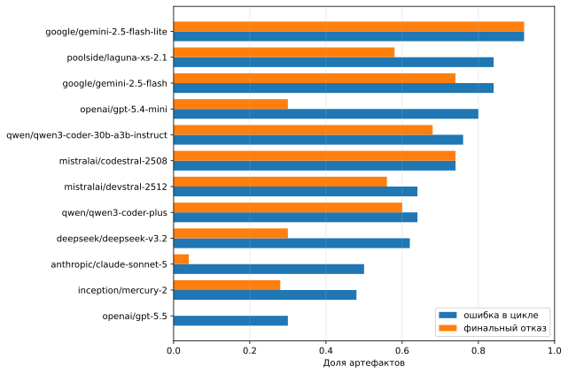
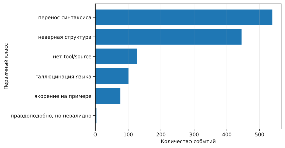
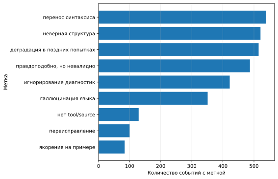
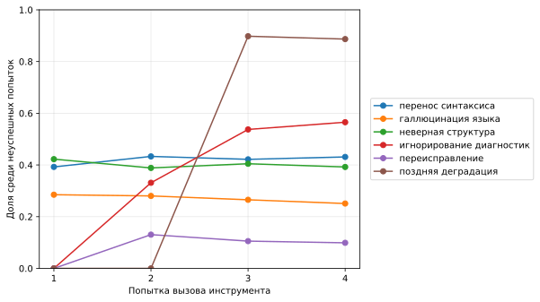
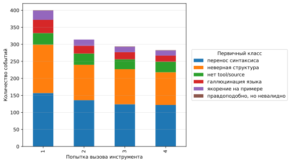
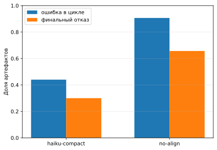

# Аннотация

Современные большие языковые модели хорошо генерируют код на популярных языках
программирования, но их поведение на низкоресурсных языках и
предметно-ориентированных языках остаётся менее устойчивым. В этой работе
рассматривается генерация моделей на MDL — специализированном формальном языке
для представления нормативных утверждений и правил — из текста контрактов и
гипотез набора ContractNLI. В отличие от статического режима «инструкция → код»,
модели имели доступ к инструменту верификации через MCP: после неуспешной
попытки они получали диагностические сообщения парсера и линтера и могли
повторить генерацию до четырёх раз.

Мы анализируем 600 ожидаемых артефактов: 12 моделей, два сценария промптинга и
25 задач в каждом сценарии. В логах найдено 1578 событий ошибок, из них 1291
неуспешный вызов инструмента верификации и 287 финальных завершений без
верифицированного исходного текста. Эвристическая разметка показывает, что
ведущие классы ошибок — перенос синтаксиса популярных языков программирования,
неверная структура программы и неправильная реакция на диагностические
сообщения. Наличие формальной диагностики существенно помогает части моделей
восстановиться, но не устраняет синтаксические priors: в поздних попытках доля
повторяющихся или неверно обработанных диагностик превышает половину неуспешных
вызовов. Результаты полезны для проектирования DSL, диагностик
LSP/MCP-инструментов и harness'ов для генерации формальных текстов с участием
LLM.

**Ключевые слова:** большие языковые модели, DSL, низкоресурсные языки
программирования, MCP, LSP, диагностики, генерация кода, MDL.

# 1. Введение

LLM стали стандартным компонентом инструментов разработки, но их успех
распределён неравномерно. Для популярных языков программирования модели видят
множество примеров в обучающих корпусах, документации, issue tracker'ах и
публичных репозиториях. Для низкоресурсных языков, внутренних DSL и новых
формальных языков такой статистической опоры нет; это приводит к худшей
синтаксической валидности и росту галлюцинаций языка [@sathvik-dsl-generation;
@giagnorio-no-silver-bullet].

Практическая мотивация этой работы возникла при разработке системы
автоматического поиска противоречий в контрактах. Система переводит текстовые
утверждения в программы на MDL — формальный DSL авторов [@prokazin-mdl]. Входные
документы и гипотезы брались из ContractNLI, набора для document-level natural
language inference на юридических контрактах [@koreeda-contractnli]. Модель
должна была сгенерировать MDL-исходник и проверить его через инструмент
`mdl_verify`, возвращающий диагностические сообщения парсера и линтера.

На первый взгляд такой цикл должен резко снижать число синтаксических ошибок:
модель видит не только описание языка и примеры, но и машинно-проверяемую
обратную связь. Однако в логах повторялись одни и те же паттерны: модели
вставляли синтаксис Python/TypeScript/Rust/JSON, придумывали отсутствующие
конструкции MDL, ломали структуру модуля при локально правдоподобном тексте, а
после диагностик иногда повторяли ту же ошибку или переписывали большие
фрагменты вместо точечной правки.

Цель статьи — не построить очередной leaderboard моделей. Мы рассматриваем
модели как источник повторяющихся failure modes и задаём три вопроса:

1. Какие классы ошибок возникают при генерации текста на незнакомом DSL даже при
   наличии формальной диагностики?
2. Какие ошибки являются поверхностными синтаксическими сбоями, а какие связаны
   с циклом исправления после диагностик?
3. Какие выводы можно сделать для дизайна DSL, диагностик и harness'ов,
   ориентированных на LLM?

Основной вклад работы: таксономия ошибок, количественный анализ 1578 событий из
реальных tool traces и практические рекомендации для проектирования LLM-friendly
DSL и диагностических инструментов.

# 2. Связанные работы

## 2.1. Генерация кода для низкоресурсных языков и DSL

Проблема генерации кода на низкоресурсных языках и DSL уже выделяется как
самостоятельное направление. Обзор Joel, Wu и Fard систематизирует работы по
LLM-based code generation для LRPL/DSL и подчёркивает отсутствие стандартного
benchmark'а для этой зоны [@sathvik-dsl-generation]. Giagnorio, Martin-Lopez и
Bavota показывают, что для низкоресурсных языков нет универсального способа
улучшения: fine-tuning, in-context learning и transfer-подходы дают разные
эффекты в зависимости от языка и размера модели [@giagnorio-no-silver-bullet].

Отдельная линия работ рассматривает NL→DSL. Bassamzadeh и Methani сравнивают
fine-tuning и retrieval augmentation для DSL генерации и отмечают сохраняющиеся
синтаксические ошибки и галлюцинации имён функций
[@bassamzadeh-dsl-generation-rag]. Text2DSL формализует генерацию DSL-кода из
естественного языка как отдельный класс задач и показывает пользу
структурированного контекста: BNF-грамматики, API specification и допустимого
словаря идентификаторов [@kozachok-text2dsl]. Наша работа находится в этой же
области, но фокусируется не на повышении pass rate как таковом, а на
повторяющихся типах ошибок в diagnostic-guided цикле.

## 2.2. Грамматические ограничения и структурированное декодирование

Для формальных языков естественный способ повысить синтаксическую валидность —
дать модели явную грамматику или ограничить декодирование. Grammar Prompting
предлагает включать BNF-грамматику в in-context learning для DSL-задач
[@wang-grammar-prompting]. Подходы computer-parsable generation и grammar
masking используют CFG-ограничения во время генерации, чтобы не позволять модели
выходить за пределы допустимого синтаксиса [@jiaye-wang-computer-parsable;
@netz-grammar-masking].

Эти работы показывают, что формальные ограничения могут резко улучшить
синтаксическую валидность. В нашей постановке ограничения не применялись
непосредственно к декодеру: модель могла генерировать любой текст, но затем
получала диагностическую обратную связь от инструмента. Это ближе к тому, как
LLM фактически используются в IDE и agentic workflows: модель делает попытку,
запускает инструмент, читает диагностику и исправляет код.

## 2.3. Незнакомые языки и bias к знакомым паттернам

Работа Syntax Without Semantics вводит PyLang — язык, отсутствующий в
pretraining corpora, — и показывает разрыв между алгоритмическим пониманием и
способностью выразить решение в незнакомом синтаксисе
[@vinayshekhar-unseen-language]. Близкая к нашей теме работа Unintended Changes
анализирует, как LLM портят и исправляют текстовые модели на DSL, незнакомом
модели, и связывает это с bias toward frequently encountered training data
[@netz-unintended-changes].

Наши данные поддерживают похожий вывод, но в другой постановке: вместо
редактирования существующей модели мы анализируем генерацию MDL из естественного
языка и последующий repair-loop по инструментальным диагностикам.

## 2.4. Обратная связь от инструментов

Интерактивная генерация кода с execution feedback исследуется в InterCode
[@yang-intercode]. FeedbackEval проверяет, как LLM используют разные типы
обратной связи в code repair [@dai-feedbackeval]. Monitor-guided decoding
применяет static analysis во время генерации [@agrawal-monitor-guided], а LSPRAG
использует LSP-серверы для получения точного контекста при генерации unit tests
[@go-lsprag].

В отличие от этих работ, мы рассматриваем не популярные языки или repository
context, а новый DSL и конкретный вопрос: какие типичные ошибки остаются даже
тогда, когда модель получает диагностики формального инструмента.

# 3. Экспериментальная постановка

## 3.1. Задача

Единица генерации — один MDL-артефакт для пары «контрактная ситуация /
гипотеза». Модель получает естественно-языковое описание и должна построить
MDL-модуль. Сгенерированный исходник проверяется инструментом `mdl_verify`. В
случае неуспеха модель получает диагностические сообщения и может сделать
следующую попытку.

В логах различаются два типа ошибок:

- `failed_tool_attempt`: неуспешный вызов инструмента верификации. Такая ошибка
  имеет фазу `parse`, `lint`, `input` или `missing-tool-call`.
- `generation_error`: финальное завершение без верифицированного MDL-исходника
  или provider-level ошибка.

Если не оговорено иное, анализ классов ошибок ниже построен только по
`failed_tool_attempt`, потому что именно они содержат исходный текст,
diagnostics и попытку исправления.

## 3.2. Модели и сценарии промптинга

В исходных конфигурациях было 13 моделей, но `cohere/north-mini-code` исключена
из анализа, поскольку она не дала успешных артефактов и вносила в распределение
provider-level шум, а не содержательные MDL-ошибки. В итоговый анализ вошли 12
моделей. Для каждой модели запускались два сценария промптинга по 25 задач,
выбранных детерминированно через seeded hash. Максимальное число tool-call
попыток для одного артефакта — 4.

Таблица 1: Конфигурация эксперимента.

| Параметр                                 | Значение |
| ---------------------------------------- | -------: |
| Число моделей в анализе                  |       12 |
| Сценарии промптинга                      |        2 |
| Задач на модель в сценарии               |       25 |
| Ожидаемых артефактов                     |      600 |
| Максимум вызовов `mdl_verify`            |        4 |
| Событий ошибок всего                     |     1578 |
| Неуспешных вызовов инструмента           |     1291 |
| Финальных завершений без verified source |      287 |

Сценарии назывались `haiku-compact` и `no-align` по именам конфигураций. В
основном анализе они агрегируются, поскольку цель статьи — таксономия ошибок.
Тем не менее различие между сценариями важно для интерпретации: compact-промпт
дал меньше артефактов с ошибками, но чаще вызывал якорение на примерах.

## 3.3. Таксономия и эвристическая разметка

Разметка построена как hybrid scheme:

- `surface_primary_class` — один первичный класс поверхности ошибки,
  используемый для распределения событий без двойного счёта;
- multi-label флаги — перекрывающиеся признаки, позволяющие видеть, что один и
  тот же event может быть одновременно переносом синтаксиса, поздней деградацией
  и игнорированием диагностики.

Таблица 2: Классы ошибок и число событий. В колонке «первичный класс» события
считаются без пересечений; в колонке «multi-label» одно событие может входить в
несколько классов.

| Класс                                          | Критерий разметки                                                                                                     | Первичный класс | Multi-label |
| ---------------------------------------------- | --------------------------------------------------------------------------------------------------------------------- | --------------: | ----------: |
| Перенос синтаксиса популярных языков           | `;`, `//`, `{}`, `=>`, `::`, `def`, `return`, assignment-style declarations и другие признаки чужого синтаксиса       |             539 |         539 |
| Неверная структура программы                   | Локально правдоподобные MDL-фрагменты нарушают модуль, вложенность, порядок деклараций или ожидаемую форму выражения  |             445 |         521 |
| Галлюцинация языка                             | Отсутствующие в MDL конструкции, модификаторы, кванторы, декларации или нормативные keywords как синтаксические формы |             101 |         351 |
| Якорение на примере                            | Копирование имён и паттернов из prompt-примеров вместо адаптации правила к текущему контракту                         |              76 |          84 |
| Нет tool/source                                | Модель не передала непустой MDL-исходник или нарушила ожидаемую форму tool call                                       |             127 |         129 |
| Человечески правдоподобно, формально невалидно | В тексте много корректно выглядящих MDL-конструкций, но парсер или линтер отклоняет программу                         |               3 |         487 |
| Игнорирование или неверное чтение диагностик   | После feedback повторяется тот же diagnostic fingerprint или исправляется не та область                               |               — |         422 |
| Переисправление                                | После feedback изменяется слишком большая часть исходника, что часто ломает уже валидные фрагменты                    |               — |         100 |
| Деградация в позднем контексте                 | Ошибка возникает в попытках 3–4 и совпадает с синтаксическим переносом, галлюцинацией или нарушением структуры        |               — |         515 |

Разметка эвристическая: она предназначена для выявления повторяющихся паттернов
и ручной калибровки, а не для окончательной gold-аннотации. Поэтому ниже мы не
интерпретируем малые различия между близкими категориями как статистически
значимые.

# 4. Результаты

## 4.1. Общая картина

Из 600 ожидаемых артефактов 404 имели хотя бы одно событие ошибки в цикле
генерации. Это не равно финальному провалу: 117 артефактов имели промежуточные
неуспешные попытки, но не завершились `generation_error`. Ещё 196 артефактов не
имели записанных ошибок. Финальных завершений без verified source было 287, то
есть 47,8% от всех ожидаемых артефактов.

По фазам неуспешных tool calls доминировал парсер: 996 из 1291 событий, или
77,1%. На lint пришлось 161 событие (12,5%), на input-ошибки — 115 (8,9%), на
missing tool call — 19 (1,5%). Это означает, что основной барьер в данном
эксперименте был не в тонкой семантике MDL, а в достижении формально допустимой
поверхности программы.



Разброс между моделями велик: доля артефактов с хотя бы одной ошибкой в цикле
варьирует от 30% до 92%. При этом этот показатель не совпадает с финальным
failure rate. Некоторые модели часто ошибались на промежуточных попытках, но
восстанавливались после диагностики; у других почти каждое событие ошибки
приводило к финальному отсутствию verified source. Поэтому в дальнейшем мы
анализируем не только итоговый статус артефакта, но и сами события ошибок.

## 4.2. Поверхностные классы ошибок

В первичной классификации два класса покрывают 76,2% неуспешных вызовов
`mdl_verify`: перенос синтаксиса популярных языков (539 событий, 41,8%) и
неверная структура программы (445 событий, 34,5%). Остальные первичные классы
встречаются заметно реже: отсутствие tool/source — 127 событий, галлюцинация
языка — 101, якорение на примерах — 76.



Перенос синтаксиса проявлялся в знакомых для популярных языков деталях: точки с
запятой, C/JavaScript-комментарии `//`, блоки в `{}`, assignment-style
объявления и keywords вроде `def`, `return`, `interface`, `struct`. Характерный
пример из логов:

```mdl
159: rule O define_confidential_information:
160:   confidential_information_technical_data or
161:   confidential_information_know_how or
```

Диагностика в этом случае указывала, что после `rule O ...:` ожидается
выражение, но модель оставила форму многострочного списка, характерную для более
свободных языков разметки или псевдокода. В другом примере модель перешла к
почти C/JavaScript-поверхности:

```mdl
3: // Parties
4: entity company { }
```

Такие ошибки особенно важны для дизайна DSL. Если новый язык «почти похож» на
знакомый язык, модель может переносить не только полезные паттерны, но и
недопустимые разделители, блоки и комментарии.

## 4.3. Multi-label анализ: ошибки накладываются друг на друга

Первичная классификация скрывает перекрытия. Multi-label разметка показывает,
что многие события одновременно являются поверхностной ошибкой и ошибкой
поведения в repair-loop. Например, событие может быть первично классифицировано
как перенос синтаксиса, но также иметь флаги `ignored_or_misread_diagnostics` и
`long_context_degradation`.



Наиболее показательное расхождение — класс «человечески правдоподобно, формально
невалидно». Как первичный класс он почти не встречается, потому что приоритет
отдаётся более конкретным поверхностным причинам. Но как флаг он присутствует в
487 событиях, или 37,7% неуспешных вызовов инструмента. Это означает, что
значительная часть программ выглядела как осмысленная MDL-модель: в них были
`module`, `type`, `entity`, `func`, `rule`, `fact`, но формальная проверка всё
равно находила ошибки.

Такое расхождение важно методологически. Если оценивать вывод модели только
человеческим чтением или LLM-judge, можно переоценить качество генерации: многие
невалидные программы выглядят структурно убедительно.

## 4.4. Что происходит после диагностик

Попытка вызова инструмента используется как практический proxy для растущего
repair-контекста. Между первой и четвёртой неуспешной попыткой доля
синтаксического переноса остаётся почти стабильной: 39,2% на первой попытке и
43,1% на четвёртой. Доля галлюцинаций языка слегка снижается: с 28,5% до 25,1%.
Доля неверной структуры также остаётся стабильной: около 39–42%.

Гораздо сильнее меняются repair-специфичные признаки. Флаг игнорирования или
неверного чтения диагностик появляется у 33,1% неуспешных вторых попыток, у
53,7% третьих и у 56,5% четвёртых. Это главный результат работы: диагностика
снижает часть ошибок, но если модель не исправилась быстро, дальнейшие попытки
всё чаще превращаются в повторение того же diagnostic fingerprint или в правку
не той области.



Распределение первичных классов по попыткам показывает похожую картину. Число
событий уменьшается с 400 на первой попытке до 283 на четвёртой, что отражает
восстановление части артефактов. Но среди оставшихся ошибок структура
распределения меняется слабо: перенос синтаксиса и неверная структура остаются
двумя ведущими классами.



Эти данные согласуются с наблюдением из ручного просмотра примеров: модель часто
понимает, что «что-то не так», но исправляет программу в направлении более
знакомого языка, а не в направлении грамматики MDL. В логе встречались повторные
diagnostics вроде `tool argument 'source' must be a non-empty string` или
повторяющиеся parse errors после почти той же поверхности исходника.

## 4.5. Влияние сценария промптинга

Сценарии промптинга не являются главным предметом статьи, но их различие слишком
велико, чтобы его игнорировать. В `haiku-compact` 132 из 300 артефактов имели
хотя бы одну ошибку в цикле, а 90 завершились без verified source. В `no-align`
соответствующие числа — 272 и 197.

Таблица 3: Итоги по сценариям промптинга.

| Сценарий        | Ожидаемых артефактов | Артефактов с ошибкой в цикле |  Доля | Финальных отказов |  Доля | Неуспешных tool calls |
| --------------- | -------------------: | ---------------------------: | ----: | ----------------: | ----: | --------------------: |
| `haiku-compact` |                  300 |                          132 | 44,0% |                90 | 30,0% |                   402 |
| `no-align`      |                  300 |                          272 | 90,7% |               197 | 65,7% |                   889 |



При этом compact-сценарий не просто «лучше по всем метрикам». В нём ниже доля
синтаксического переноса как multi-label флага: 24,4% против 49,6% у `no-align`;
ниже доля галлюцинаций языка: 12,2% против 34,0%. Но у него появляется якорение
на примерах: 84 события с этим флагом, или 20,9% неуспешных вызовов в сценарии.
В `no-align` этот класс не сработал, потому что соответствующих prompt-anchor
токенов в источниках не было.

Практический вывод: примеры и компактные инструкции могут резко улучшать
формальную валидность, но они создают другой риск — копирование поверхностных
имён и шаблонов из примера. Для DSL-harness'ов это означает, что few-shot
examples должны быть синтаксически полезными, но лексически нейтральными: имена
сущностей и правил в примерах не должны легко попадать в целевые задачи.

# 5. Обсуждение

## 5.1. Диагностики не равны грамматическим ограничениям

Доступ к parser/linter diagnostics помогает: 117 артефактов имели неуспешные
tool calls, но не завершились финальным `generation_error`. Однако diagnostics
работают как обратная связь после ошибки, а не как ограничение пространства
вывода. Если модель не имеет устойчивого представления о грамматике DSL, она
может читать диагностику как локальный текстовый совет и исправлять симптомы,
сохраняя неверный prior.

Это отличает diagnostic-guided generation от grammar-constrained decoding. В
последнем случае недопустимый токен может быть исключён до генерации. В нашем
цикле недопустимый токен уже попал в программу, а модель должна понять
формальное сообщение и изменить стратегию. Для незнакомого DSL это более сложная
задача.

## 5.2. Синтаксические priors сильнее локальной подсказки

Наиболее устойчивый класс ошибок — перенос синтаксиса популярных языков. Он не
исчезает в поздних попытках и не сводится к одному поставщику модели. Это
указывает на общий prior: когда модель видит задачу «сгенерировать формальный
текст, похожий на код», она тянется к частотным паттернам из Python, TypeScript,
Rust, JSON, C-like DSL или псевдокода.

Для дизайна новых языков отсюда следует парадоксальный вывод. DSL, который
выглядит «почти как популярный язык», может быть хуже для LLM, чем более явно
отличающийся язык, если отличия затрагивают частотные элементы: комментарии,
блоки, разделители, объявления функций и правила вложенности. Почти знакомый
синтаксис провоцирует ложный перенос.

## 5.3. Repair-loop усиливает часть ошибок

Поздние попытки не только исправляют ошибки, но и создают новые. Флаг
переисправления срабатывает в 100 событиях: модель после feedback переписывает
большой фрагмент исходника, хотя диагностика требует локальной правки. В
примерах это приводило к появлению новых типов, новых функций и новых
поверхностных синтаксических форм.

Это важно для проектирования harness'а. Хороший repair-loop должен поощрять
минимальные изменения: передавать модели diff, указывать точный диапазон ошибки,
просить сохранить все проверенные фрагменты и, по возможности, проверять patch,
а не полный rewrite. Иначе каждая новая попытка расширяет пространство для
деградации.

## 5.4. Рекомендации для проектирования DSL и диагностик

На основании логов можно сформулировать практические рекомендации.

Для дизайна DSL:

- избегать «почти TypeScript/Python/Rust» синтаксиса, если отличия неочевидны;
- делать форму top-level деклараций однообразной;
- минимизировать контекстно-зависимые правила отступов и порядка секций;
- иметь один канонический formatter и показывать его вывод в prompt'е;
- запрещённые популярные формы лучше явно упоминать в спецификации: `;`, `//`,
  `{}`, `forall`, list literals, assignment-style declarations.

Для диагностик:

- писать не только `unexpected token`, но и минимальное исправление: «удали
  `;`», «замени `//` на `#`», «`func` требует `-> bool` перед `:`»;
- группировать повторяющиеся diagnostics, чтобы модель не терялась в длинном
  списке однотипных parse errors;
- отмечать, что уже исправлено и что нельзя переписывать;
- возвращать machine-readable code для диагностики, а не только текстовое
  сообщение.

Для harness'а:

- отделять первичную генерацию от локального ремонта;
- требовать patch/minimal edit после первой диагностики;
- ограничивать число полных rewrite;
- сохранять trace всех diagnostics, чтобы выявлять repeated diagnostic
  fingerprints;
- использовать few-shot examples с нейтральными именами, чтобы снижать prompt
  anchoring.

# 6. Угрозы валидности

**Эвристическая разметка.** Метки строились правилами по source, diagnostics и
diff-признакам. Они хорошо подходят для поиска повторяющихся паттернов, но не
заменяют ручную gold-разметку. В частности, `long_context_degradation` зависит
от номера попытки и поэтому должен интерпретироваться как индикатор поздней
ошибки, а не доказательство причинности.

**Ограниченный набор задач.** В каждом сценарии использовалось 25 задач
ContractNLI. Это даёт 600 артефактов за счёт множества моделей и сценариев, но
не покрывает всё разнообразие контрактов и формальных утверждений.

**Один целевой DSL.** MDL имеет собственные синтаксические решения и предметную
область. Частоты классов нельзя напрямую переносить на другие DSL. Более
устойчивым результатом является не абсолютная доля каждого класса, а сама
структура ошибок: перенос популярного синтаксиса, галлюцинация языка, нарушение
программы и сбои repair-loop.

**Модели и поставщики.** Модели запускались через OpenRouter, а часть ошибок
может зависеть от provider behavior, tool-call формата и текущих версий моделей.
Поэтому результаты не следует трактовать как окончательный рейтинг моделей.

**Формальная валидность не равна семантической корректности.** В этой работе
анализируется путь к parse/lint-valid MDL. Артефакт без ошибок инструмента может
всё ещё неверно моделировать исходный контракт. Полная оценка семантической
корректности требует отдельной проверки.

# 7. Заключение

Эксперимент показывает, что инструментальная диагностика не устраняет
систематические синтаксические priors LLM при генерации незнакомого DSL. В 1291
неуспешном вызове верификатора доминировали перенос синтаксиса популярных языков
и неверная структура программы. В поздних попытках всё чаще появлялось
игнорирование или неверное чтение диагностик, что показывает ограниченность
простого цикла «сгенерируй → получи ошибку → попробуй снова».

Главный практический вывод состоит в том, что DSL и инструменты вокруг него
нужно проектировать не только для человека и парсера, но и для модели, которая
будет генерировать этот язык. Явная грамматика, канонические примеры, точные
diagnostics, machine-readable error codes и ограничения на rewrite могут быть не
менее важны, чем выразительность самого языка.

# Приложение A. Итоги по моделям

Таблица A1: Артефакты с ошибкой в цикле и финальные отказы по моделям. Доля
«ошибка в цикле» не означает финальный провал: часть артефактов была
восстановлена после диагностики.

| Модель                              | Ожидаемых артефактов | С ошибкой в цикле | Доля | Финальных отказов | Доля |
| ----------------------------------- | -------------------: | ----------------: | ---: | ----------------: | ---: |
| `google/gemini-2.5-flash-lite`      |                   50 |                46 |  92% |                46 |  92% |
| `google/gemini-2.5-flash`           |                   50 |                42 |  84% |                37 |  74% |
| `poolside/laguna-xs-2.1`            |                   50 |                42 |  84% |                29 |  58% |
| `openai/gpt-5.4-mini`               |                   50 |                40 |  80% |                15 |  30% |
| `qwen/qwen3-coder-30b-a3b-instruct` |                   50 |                38 |  76% |                34 |  68% |
| `mistralai/codestral-2508`          |                   50 |                37 |  74% |                37 |  74% |
| `qwen/qwen3-coder-plus`             |                   50 |                32 |  64% |                30 |  60% |
| `mistralai/devstral-2512`           |                   50 |                32 |  64% |                28 |  56% |
| `deepseek/deepseek-v3.2`            |                   50 |                31 |  62% |                15 |  30% |
| `anthropic/claude-sonnet-5`         |                   50 |                25 |  50% |                 2 |   4% |
| `inception/mercury-2`               |                   50 |                24 |  48% |                14 |  28% |
| `openai/gpt-5.5`                    |                   50 |                15 |  30% |                 0 |   0% |

# Приложение B. Примеры типичных ошибок

Таблица B1: Короткие примеры из логов разметки.

| Класс                        | Пример                                                                      | Диагностический сигнал                                 |
| ---------------------------- | --------------------------------------------------------------------------- | ------------------------------------------------------ |
| Перенос синтаксиса           | `rule O define_confidential_information:` затем многострочный список с `or` | `extraneous input '<NEWLINE>' expecting ...`           |
| Галлюцинация языка / перенос | `// Parties`, `entity company { }`                                          | `unsupported comment syntax //; use # comment`         |
| Игнорирование диагностики    | Повторный вызов без непустого `source`                                      | `tool argument 'source' must be a non-empty string`    |
| Переисправление              | После feedback source-change-ratio 0.72 и новые неподдержанные конструкции  | Новые `undefined type`, неверные function declarations |
| Якорение на примере          | Повтор имён вроде `independent_development_allowed` и duplicate rule names  | `duplicate RuleDecl name ...`                          |
| Поздняя деградация           | `model SimpleModel {` в четвёртой попытке                                   | `missing 'module' at 'model'`                          |
